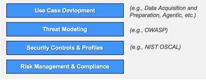
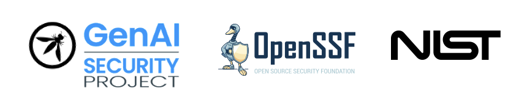

# Security and Compliance Work Group

This repository is used to develop and manage the Security and Compliance Work Group's assets as well as those from its subgroups.  This may include use cases, threat models, profiles, and other artifacts.

## Mission statement

<table style="border-collapse: collapse; border: none;">
<tr>
  <td style="border: none; background-color: #C8F0FF;">The LF AI & Data Security and Compliance Work Group is dedicated to formulating interconnected security use cases, threat models, and policies that can be leveraged to create a comprehensive security and compliance strategy for AI-enabled applications throughout their lifecycle. The committee will establish a framework, which references and incorporates existing AI and ML standards and technologies, that enables an automated, self-sustaining cycle where effective governance fosters secure AI development, deployment and operations and AI-driven governance systems that can reduce risk and improve compliance in critical regulated environments.</td>
</tr>
</table>

## How to get involved

#### Meetings and mailing lists

The work group will use the shared LF meeting management platform for all calls and formal communications and requires an LF account to participate.

In addition, the LF AI & Data Foundation has a separate account to which will be used by work group members for work group-specific communications and calendaring:

- https://lists.lfaidata.foundation/g/security-and-compliance-work-group

##### Creating LF accounts

1. Create a Linux Foundation account

    - https://docs.linuxfoundation.org/lfx/sso/create-an-account
    - Fill out your LF profile in the Individual Dashboard: [openprofile.dev](openprofile.dev)
        - *Please “Connect your Github” using an email address associated with your Github account.*

1. Register for an LF AI & Data Account
    - https://lists.lfaidata.foundation/register
        - *Please use the same email address as your LF account.*

#### Communication channels

Please join our Slack for informal communication with work group contributors.

<li style="margin-left: 40px;">Join the LF AI & Data Foundation Slack: <a href="https://slack.lfaidata.foundation/">https://slack.lfaidata.foundation/</a></li>
<li style="margin-left: 40px;">Join the project channel: <a href="https://lfaifoundation.slack.com/archives/C041ZAXCSJ0">#security-and-compliance-work-group</a></li>

<!-- <table style="border-collapse: collapse; border: none;">
<tr style="border: none;">
  <td style="border: none; vertical-align: top;"></td>
  <td style="border: none;"><li>Join the LF AI & Data Foundation Slack: <a href="https://slack.lfaidata.foundation/">https://slack.lfaidata.foundation/</a></li>
  <li>Join the project channel: <a href="https://lfaifoundation.slack.com/archives/C041ZAXCSJ0">#security-and-compliance-work-group</a></li>
  </td>
</tr>
</table> -->

---

## Project structure

Initially, the work group will establish two subgroups to better divide and focus work against specific subject areas.

- Use cases and threat models
- Compliance and risk management

Work group members are encouraged to join and contribute to these subgroups each of which manages its own bi-weekly meetings.

The subgroups will provide updates of its activities as part of the work group's meeting agenda.

#### Planned activities

A high-level view of the activity areas the work group and its subgroups will facilitate:

#### Standards and project collaboration

The work group intends to collaborate with and reference work from other foundations and organizations including:

- [OWASP Foundation](https://owasp.org/)
    – [GenAI Security Project](https://genai.owasp.org/),
    - [Application Security Verification Standard (ASVS)](https://owasp.org/www-project-application-security-verification-standard/)
    - [Software Component Verification Standard (SCVS)](https://owasp.org/www-project-software-component-verification-standard/)
    - [CycloneDX](https://cyclonedx.org/) - Bill-of-Materials (BOM) standard and its [work groups](https://cyclonedx.org/participate/working-groups/) and profiles including:
        - *Machine Learning Transparency (MLBOM)*
        - *Threat Modeling (TMBOM)*
- [Linux Foundation](https://www.linuxfoundation.org/) and its projects including:
  - [Software Package Data Exchange (SPDX)](https://spdx.dev/) - Bill-of-Materials (BOM) standard and its area of interest including:
    - *[SPDX AI](https://spdx.dev/learn/areas-of-interest/ai/)*
- [OpenSSF](https://openssf.org/) and its work groups and guidelines:
    - [AI/ML Security work group](https://openssf.org/technical-initiatives/ai-ml-security/)
    - [Supply-chain Levels for Software Artifacts (SLSA)](https://openssf.org/projects/slsa/) - specification and its ability to measure [Secure Software Development Framework (SSDF)](https://csrc.nist.gov/Projects/ssdf) compliance.
- [NIST](https://www.nist.gov/) and its standards:
    - [Open Security Controls Assessment Language (OSCAL)](https://pages.nist.gov/OSCAL/) - security controls and profiles.s
    - [Secure Software Development Framework (SSDF)](https://csrc.nist.gov/Projects/ssdf) - secure software development practices.

---

## References

This section contains additional references to projects and resources that the work group might find useful:

- [OWASP Threat Dragon](https://owasp.org/www-project-threat-dragon/) - a modeling tool used to create threat model diagrams as part of a secure development lifecycle.

## Code of Conduct

The work group and its subgroups adhere to the LF AI & Data's Code of Conduct (CoC) as published here:

- https://github.com/lfai/foundation/blob/main/codeofconduct.md

## License

All repository content is licensed under the [Apache 2.0 license](LICENSE) unless otherwise noted. Including:

- *Displayed [logos](images/logos) are copyrighted and/or  trademarked by their respective owners.*