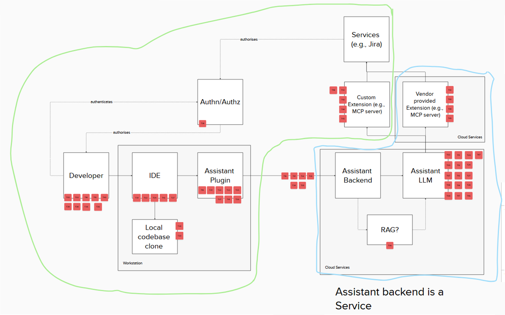
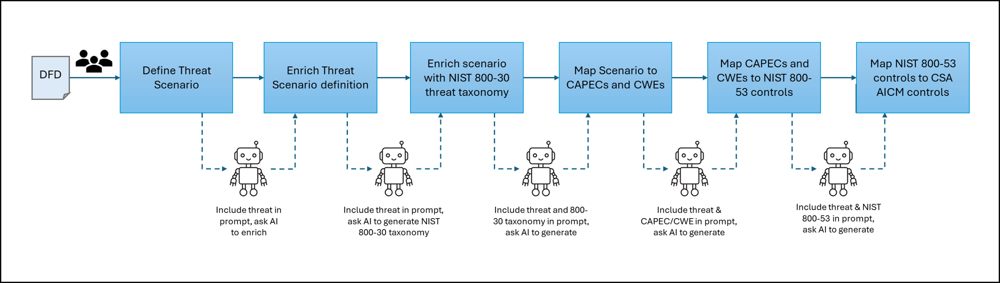
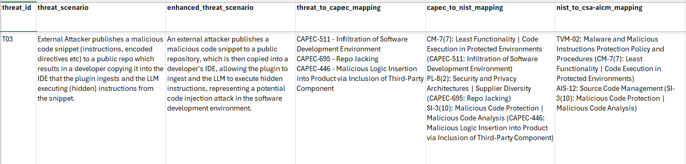

# Security and Compliance Work Group

## Use Cases and Threat Modeling Subgroup

> [!IMPORTANT]
> - The **Use Cases and Threat Modeling** subgroup meets weekly on Tuesdays @12pm US Eastern, 16:00 GMT.  Please use the calendar link below and click the "Need an invite?" link:
>     - [LF AI & Data calendar entry]( https://zoom-lfx.platform.linuxfoundation.org/meeting/93191199454?password=83a7bf08-2b26-44bc-aefd-8ad68b29c733)
>   - Slack: [#security-use-cases-and-threat-modeling](https://lfaifoundation.slack.com/archives/C09DHAQ399P)
>   - Meeting Agendas/Notes: [Google Doc](https://docs.google.com/document/d/1GzbzYeuvrXQIr9Uj6TiVXTrmnLPngOY7vuxc-CjOnas/edit?usp=drive_link)

### Leadership

##### Chairs:
  - Matt Colman ([IBM](https://www.ibm.com/))
    - mtcolman@uk.ibm.com
    - Slack: @Matt Colman
  - Petra Vukmirovoc ([Numan](https://www.numan.com/))
    - Slack: @petra vukmirovic

### Mission

To produce interoperable AI security and compliance standards through its lifecycle-wide use cases that with corresponding controls and risk mitigation measures informed by a library of real world threat models, make them directly consumable by automated security, compliance, and governance workflows.

### Goals

1. Identify and publish at least 3 pilot use cases + threat models in OWASP Threat Model Library
2. Align on the use case - threat model (threats, controls, risks) - standard workflow

### Guidance

Threat statements need to be written with the following structure:

"Actor A ('the who') does B ('action') to C ('technical component') which results in doing D ('the reason') to E ('the resource')"

E.g.: "Attacker ('the who') tampers ('malicious action') with REST service parameters ('technical component') to view ('the reason') unauthorised customer data ('the resource')"

### Process to follow

1. Generate threats (supply the guidance above for reference)
2. Ensure threats are written following the structure above (amend any that aren't)
3. Convert/Map threat statements to NIST 800-30 taxonomy (threat source, threat event, and adverse impact)
4. Map to CAPEC & CWE
5. Map to Controls (NIST 800-53 and CSA AICM)

### Current Work

We have threat modelled the use case "AI Assistant Code Generator" (based on using a code-generating AI assistant as a plugin in IDE).

The DFD lives [here on Mural](https://app.mural.co/t/securityusecasesandthreatmod1795/m/securityusecasesandthreatmod1795/1761143364260/4f8be761b012f15453ff697a978bf113e9ac215c).

The Threat Model lives [here on google Docs](https://docs.google.com/spreadsheets/d/1SaB_a9iaSDTNvnyFJznMuBHIXmkDP1fcHX2ltcyJeUs/edit?usp=sharing) (please request access if needed)

We are currently creating an automated, AI driven process to utilise AI to:

 - Enrich threat scenario text to ensure high quality
 - Convert scenario to [NIST 800-30 threat taxonomy](https://nvlpubs.nist.gov/nistpubs/Legacy/SP/nistspecialpublication800-30r1.pdf)
 - Map threat scenario to [Common Attack Pattern Enumerations and Classifications (CAPEC)](https://capec.mitre.org/)
 - Map the CAPEC to [NIST SP800-53 Security and Privacy Controls for Information Systems and Organizations](https://csrc.nist.gov/projects/risk-management/sp800-53-controls/downloads) controls
 - Map NIST SP800-53 controls to [Cloud Security Alliance AI Controls Matrix (CSA AICM)](https://cloudsecurityalliance.org/artifacts/ai-controls-matrix) controls (where the threat is AI specific/focused)

**Note:** The way we define Threat Intent (as per NIST 800-30) is either: Intent by proxy _or_ Direct intent. So a Vendor can be adversarial even if it is by proxy through an attacker if they are compromised

This gives us the following mapping:

