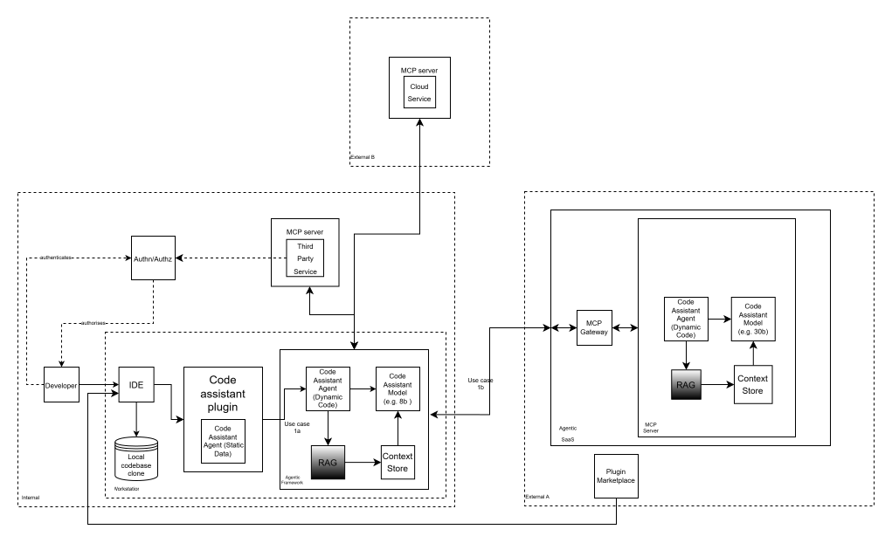

# Use Case: Code Assistant

This document provides concise definitions of the items used in threat modeling diagram.

Diagram (draw.io): 

[Edit this diagram (draw.io XML)](./diagram/ai_code_generator_threat_model_diagram_updated_2026_05_12.drawio)

## Sub Use Case 1a:
The developer's workstation hosts the full agentic framework, including the dynamic agent, model, RAG, and context store. The assistant plugin communicates directly with locally running components, with MCP servers bridging internal third-party services and external cloud platforms.

```
Internal
├── MCP Server
│   └── Third Party Service
├── Authn/Authz
└── Workstation
    ├── IDE
    ├── Local Codebase Clone
    ├── Code Assistant Plugin
    │   └── Code Assistant Agent (Static Code)
    └── Agentic Framework
        ├── Code Assistant Agent (Dynamic Code)
        ├── Code Assistant Model (e.g. 8b)
        ├── RAG
        └── Context Store

External Cloud
└── MCP Server
    └── Cloud Service
```

## Sub Use Case 1b:
The agentic framework is offloaded to an external SaaS platform, which hosts the dynamic agent, model, RAG, and context store behind an MCP Gateway. The workstation retains the plugin and static agent, with MCP servers connecting to both internal third-party services and external cloud platforms.

```
Internal
├── MCP Server
│   └── Third Party Service (e.g. Jira, GitHub)
├── Authn/Authz
└── Workstation
    ├── IDE
    ├── Local Codebase Clone
    ├── Code Assistant Plugin
    │   └── Code Assistant Agent (Static Code)
    └── Agentic Framework

External SaaS
├── Plugin Marketplace
└── Agentic SaaS
    ├── MCP Gateway
    └── MCP Server (e.g. Claude code)
        ├── Code Assistant Agent (Dynamic Code)
        ├── Code Assistant Model (e.g. 30b)
        ├── RAG
        └── Context store

External Cloud
└── MCP Server
    └── Cloud Service (e.g. AWS, GCP)
```

## Canonical Diagram Entity Mapping

| Canonical Name                      | Taxonomy Group         | Usecases | Group          |
| ----------------------------------- | ---------------------- | -------- | -------------- |
| Developer                           | Actor                  | 1a,1b    | Internal       |
| Code Assistant Plugin               | Data                   | 1a,1b    | Internal       |
| Local Codebase Clone                | Data                   | 1a,1b    | Internal       |
| IDE                                 | Application            | 1a,1b    | Internal       |
| Authentication Service              | Application            | 1a,1b    | Internal       |
| Authorization Service               | Application            | 1a,1b    | Internal       |
| Third Party MCP Server              | Application            | 1a,1b    | Internal       |
| MCP Server — Third Party Service    | Application            | 1a,1b    | Internal       |
| Code Assistant Agent (Static Code)  | Application            | 1a,1b    | Internal       |
| Code Assistant Agent (Dynamic Code) | Application            | 1a       | Internal       |
| Code Assistant Agent (Dynamic Code) | Application            | 1b       | External SaaS  |
| Agentic Framework                   | Framework              | 1a       | Internal       |
| Agentic Framework                   | Framework              | 1b       | External SaaS  |
| Local Code Assistant Model          | Machine-Learning-Model | 1a       | Internal       |
| Remote Code Assistant Model         | Machine-Learning-Model | 1b       | External SaaS  |
| Local RAG                           | Application            | 1a       | Internal       |
| Remote RAG                          | Application            | 1b       | External SaaS  |
| Local Context Store                 | Data                   | 1a       | Internal       |
| Remote Context Store                | Data                   | 1b       | External SaaS  |
| MCP Gateway                         | Application            | 1b       | External SaaS  |
| MCP Server — Agentic SaaS           | Application            | 1b       | External SaaS  |
| External Plugin Marketplace         | Platform               | 1b       | External SaaS  |
| Agentic SaaS                        | Platform               | 1b       | External SaaS  |
| MCP Server — Cloud Service          | Application            | 1a,1b    | External Cloud |
| Cloud Service (AWS/GCP/etc.)        | Application            | 1a,1b    | External Cloud |

## Diagram Content
The following taxonomy is aligned to available component types as present in [CycloneDX 1.7/2.0+](https://cyclonedx.org/docs/1.7/json/#metadata_tools_oneOf_i0_components_items_type). An example is shown below:

```json
{
  "bomFormat": "CycloneDX",
  "specVersion": "1.7",
  "version": 1,
  "components": [
    {
      "bom-ref": "authn-service",
      "type": "application",
      "name": "Authentication Service"
    }
  ]
}
```

**Note:** Parties/Roles to cover the Threat Modelling concept of Actors will be available from CycloneDX 2.0.

### Parties/Roles (Actors)

Humans or services that take action

- **Developer**
  The human actor who writes, modifies, and maintains code—considered a potential target (e.g., phishing, credential theft) or source of risk (e.g., introducing vulnerabilities or misconfigurations).

- **Code Assistant Agent (Static Code)**
  An AI model embedded within the assistant plugin that combines reasoning and tool interaction capabilities (e.g., APIs, code execution) to perform actions directly within the developer environment. In threat modeling it is treated as an active actor, since these capabilities can be leveraged—intentionally or through manipulation such as prompt injection—to carry out malicious or unintended actions including data exfiltration, unsafe operations, or abuse of integrated services.

- **Local Code Assistant Agent (Dynamic Code)**
  A locally hosted AI model within the agentic framework that combines reasoning and tool interaction capabilities to orchestrate multi-step workflows, invoke external services, and coordinate with the broader agent ecosystem. In threat modeling it is treated as an active actor with an expanded blast radius relative to its static counterpart—its autonomous, multi-tool operation makes it susceptible to prompt injection, workflow hijacking, and cascading misuse of integrated systems.

- **Remote Code Assistant Agent (Dynamic Code)**
  A remotely hosted AI model within the agentic framework that combines reasoning and tool interaction capabilities to orchestrate multi-step workflows, invoke external services, and coordinate with the broader agent ecosystem. In threat modeling it is treated as an active actor with an expanded blast radius relative to its static counterpart—its autonomous, multi-tool operation makes it susceptible to prompt injection, workflow hijacking, and cascading misuse of integrated systems.

### Components

#### Group

Used to describe the control zones of an organization relative to the usecases of the org.

- **Internal**  
  Systems, APIs, or infrastructure owned and operated within the organization’s environment—generally more trusted but still pose risks such as misconfigurations, lateral movement, and insider threats.

- **External SaaS**  
  Third-party managed software platforms that provide application or agentic capabilities (SaaS-style trust boundary) — introduce additional risks including supply chain vulnerabilities, data exposure, and limited visibility or control over security practices.

- **External Cloud**  
  Third-party infrastructure and cloud service providers used as dependencies or execution targets — introduce additional risks including supply chain vulnerabilities, data exposure, and limited visibility or control over security practices.

#### Data

Data at rest or data in motion

- **Code Assistant Plugin**  
  A compromised or intentionally malicious AI-powered IDE plugin that appears to assist with coding but performs unauthorized actions—introducing risks such as data exfiltration, credential harvesting, backdoor insertion, or manipulation of code and outputs.  

- **Local Codebase clone**  
  A developer’s local copy of a repository—treated as a sensitive asset since it may contain proprietary code, secrets, or configurations that could be exposed if the endpoint is compromised.

- **Local Context Store**  
  A locally hosted data store that supplies structured or unstructured content to the model or retrieval pipeline to enrich responses. Risks include unauthorized access to sensitive stored content, poisoning of the data corpus, and data leakage via model outputs.

- **Remote Context Store**  
  A remotely hosted data store that supplies structured or unstructured content to the model or retrieval pipeline to enrich responses. Risks include unauthorized access to sensitive stored content, poisoning of the data corpus, and data leakage via model outputs.

- **RAG data**  
  TBC

#### Application

- **Integrated Development Environment (IDE)**  
  The software environment (e.g., VS Code, IntelliJ) where code is written and tested—an attack surface due to risks like malicious extensions, insecure settings, or credential exposure.

- **Authentication Service**  
  The service for verifying the identity of a user or system (e.g., passwords, tokens, MFA)—risks include credential theft, weak authentication mechanisms, and session hijacking.

- **Authorization Service**  
  The service for determining what an authenticated user or system is allowed to access or perform—risks include excessive permissions, privilege escalation, and misconfigured access controls.

- **Third Party MCP Server**
  An organization-operated MCP server that integrates the assistant with internal third-party services. Poses risks if misconfigured or inadequately secured, including unauthorized data access, insecure API exposure, and privilege escalation through service integrations.

- **Local RAG**  
  A component, hosted locally, that dynamically fetches relevant content from available data sources to augment the model's context and improve response quality. Introduces risks around ingestion of untrusted or manipulated content, exposure of sensitive data through retrieval, and injection of malicious inputs that propagate into model outputs.

- **Remote RAG**  
  A component, hosted remotely, that dynamically fetches relevant content from available data sources to augment the model's context and improve response quality. Introduces risks around ingestion of untrusted or manipulated content, exposure of sensitive data through retrieval, and injection of malicious inputs that propagate into model outputs.
  
- **MCP Server — Cloud Service**  
  A vendor-operated MCP server that integrates the assistant with external cloud platforms and services. Introduces supply chain risks including vulnerable or malicious dependencies, excessive permissions, and potential exfiltration of data passed through the integration.

- **MCP Server — Agentic SaaS**
  The MCP server component hosted within the Agentic SaaS platform, responsible for exposing assistant capabilities and orchestrating downstream agent, model, and retrieval components. A high-value target due to its central role—risks include unauthorized access, data interception, and abuse of its broad orchestration capabilities.

- **MCP Gateway**
  The ingress service (e.g., proxy, API gateway, or firewall) that receives and routes inbound connections to the assistant backend. Acts as a perimeter trust boundary—misconfiguration or compromise can expose backend infrastructure to unauthorized access or traffic manipulation.

#### Platform

- **External Plugin Marketplace**  
  An externally operated third-party platform where developers discover and install IDE plugins or extensions—introduces supply chain risks such as malicious or vulnerable plugins, insufficient vetting, and potential for unauthorized data access or exfiltration.

- **Agentic SaaS**
  An externally operated platform that delivers agentic assistant capabilities as a managed service. Introduces risks related to third-party data handling, limited visibility into model behavior and data flows, dependency on external availability, and reduced control over security posture.

#### Framework

- **Agentic Framework**  
  The orchestration layer that coordinates multi-step, tool-using workflows on behalf of the assistant. Manages execution flow between the model, retrieval systems, and external services—a high-impact trust boundary where prompt injection, tool misuse, or unintended action chains can have significant consequences.

### Machine-Learning-Model

- **Local Code Assistant Model**  
  The core AI model that generates responses or code suggestions. Run locally (e.g., a self-hosted model). Relevant in threat modeling due to risks like prompt injection, data leakage, model manipulation, and insecure output generation. This is a component within the Agent.

- **Remote Code Assistant Model**  
  The core AI model that generates responses or code suggestions. Run remotely (e.g., a cloud-hosted model such as a 30B-parameter model). Relevant in threat modeling due to risks like prompt injection, data leakage, model manipulation, and insecure output generation. This is a component within the Agent.

## CycloneDX v1.7 — Code Assistant Threat Model BOM

```json
{
  "bomFormat": "CycloneDX",
  "specVersion": "1.7",
  "version": 1,
  "components": [
    {
      "type": "device",
      "bom-ref": "actor-developer",
      "name": "Developer",
      "description": "The human actor who writes, modifies, and maintains code—considered a potential target or source of risk.",
      "properties": [
        { "name": "cdx:category", "value": "actor" },
        { "name": "cdx:environment", "value": "Internal" },
        { "name": "cdx:usecases", "value": "1a,1b" }
      ]
    },

    {
      "type": "application",
      "bom-ref": "app-ide",
      "name": "Integrated Development Environment (IDE)",
      "description": "The software environment where code is written and tested.",
      "properties": [
        { "name": "cdx:category", "value": "application" },
        { "name": "cdx:environment", "value": "Internal" },
        { "name": "cdx:usecases", "value": "1a,1b" }
      ]
    },

    {
      "type": "data",
      "bom-ref": "data-plugin",
      "name": "Code Assistant Plugin",
      "description": "AI-powered IDE plugin that may be compromised or malicious.",
      "properties": [
        { "name": "cdx:category", "value": "data" },
        { "name": "cdx:environment", "value": "Internal" },
        { "name": "cdx:usecases", "value": "1a,1b" },
        { "name": "cdx:parent", "value": "app-ide" }
      ]
    },

    {
      "type": "data",
      "bom-ref": "data-local-codebase",
      "name": "Local Codebase Clone",
      "description": "Local copy of repository containing sensitive code and secrets.",
      "properties": [
        { "name": "cdx:category", "value": "data" },
        { "name": "cdx:environment", "value": "Internal" },
        { "name": "cdx:usecases", "value": "1a,1b" }
      ]
    },

    {
      "type": "application",
      "bom-ref": "app-authn",
      "name": "Authentication Service",
      "description": "Service responsible for identity verification.",
      "properties": [
        { "name": "cdx:category", "value": "application" },
        { "name": "cdx:environment", "value": "Internal" },
        { "name": "cdx:usecases", "value": "1a,1b" }
      ]
    },

    {
      "type": "application",
      "bom-ref": "app-authz",
      "name": "Authorization Service",
      "description": "Service responsible for access control decisions.",
      "properties": [
        { "name": "cdx:category", "value": "application" },
        { "name": "cdx:environment", "value": "Internal" },
        { "name": "cdx:usecases", "value": "1a,1b" }
      ]
    },

    {
      "type": "application",
      "bom-ref": "app-mcp-third-party",
      "name": "Third Party MCP Server",
      "description": "Organization-operated MCP server integrating third-party services.",
      "properties": [
        { "name": "cdx:category", "value": "application" },
        { "name": "cdx:environment", "value": "Internal" },
        { "name": "cdx:usecases", "value": "1a,1b" }
      ]
    },

    {
      "type": "application",
      "bom-ref": "app-agent-static",
      "name": "Code Assistant Agent (Static Code)",
      "description": "AI model embedded in plugin performing tool use inside IDE.",
      "properties": [
        { "name": "cdx:category", "value": "actor" },
        { "name": "cdx:environment", "value": "Internal" },
        { "name": "cdx:usecases", "value": "1a,1b" },
        { "name": "cdx:parent", "value": "data-plugin" }
      ]
    },

    {
      "type": "application",
      "bom-ref": "app-agent-dynamic-1a",
      "name": "Code Assistant Agent (Dynamic Code)",
      "description": "Agentic model orchestrating multi-step workflows (local deployment).",
      "properties": [
        { "name": "cdx:category", "value": "actor" },
        { "name": "cdx:environment", "value": "Internal" },
        { "name": "cdx:usecases", "value": "1a" },
        { "name": "cdx:parent", "value": "framework-1a" }
      ]
    },

    {
      "type": "application",
      "bom-ref": "app-agent-dynamic-1b",
      "name": "Code Assistant Agent (Dynamic Code)",
      "description": "Agentic model orchestrating multi-step workflows (remote SaaS deployment).",
      "properties": [
        { "name": "cdx:category", "value": "actor" },
        { "name": "cdx:environment", "value": "External SaaS" },
        { "name": "cdx:usecases", "value": "1b" },
        { "name": "cdx:parent", "value": "framework-1b" }
      ]
    },

    {
      "type": "framework",
      "bom-ref": "framework-1a",
      "name": "Agentic Framework (Internal)",
      "description": "Orchestration layer for multi-step tool execution.",
      "properties": [
        { "name": "cdx:category", "value": "framework" },
        { "name": "cdx:environment", "value": "Internal" },
        { "name": "cdx:usecases", "value": "1a" }
      ]
    },

    {
      "type": "framework",
      "bom-ref": "framework-1b",
      "name": "Agentic Framework (External SaaS)",
      "description": "Cloud-hosted orchestration layer coordinating agent workflows.",
      "properties": [
        { "name": "cdx:category", "value": "framework" },
        { "name": "cdx:environment", "value": "External SaaS" },
        { "name": "cdx:usecases", "value": "1b" }
      ]
    },

    {
      "type": "machine-learning-model",
      "bom-ref": "model-local",
      "name": "Local Code Assistant Model",
      "description": "Locally hosted AI model generating code suggestions.",
      "properties": [
        { "name": "cdx:category", "value": "machine-learning-model" },
        { "name": "cdx:environment", "value": "Internal" },
        { "name": "cdx:usecases", "value": "1a" },
        { "name": "cdx:parent", "value": "framework-1a" }
      ]
    },

    {
      "type": "machine-learning-model",
      "bom-ref": "model-remote",
      "name": "Remote Code Assistant Model",
      "description": "Cloud-hosted AI model generating code suggestions.",
      "properties": [
        { "name": "cdx:category", "value": "machine-learning-model" },
        { "name": "cdx:environment", "value": "External SaaS" },
        { "name": "cdx:usecases", "value": "1b" },
        { "name": "cdx:parent", "value": "framework-1b" }
      ]
    },

    {
      "type": "application",
      "bom-ref": "rag-local",
      "name": "Local RAG",
      "description": "Local retrieval-augmented generation system.",
      "properties": [
        { "name": "cdx:category", "value": "application" },
        { "name": "cdx:environment", "value": "Internal" },
        { "name": "cdx:usecases", "value": "1a" }
      ]
    },

    {
      "type": "application",
      "bom-ref": "rag-remote",
      "name": "Remote RAG",
      "description": "Cloud-hosted retrieval-augmented generation system.",
      "properties": [
        { "name": "cdx:category", "value": "application" },
        { "name": "cdx:environment", "value": "External SaaS" },
        { "name": "cdx:usecases", "value": "1b" }
      ]
    },

    {
      "type": "data",
      "bom-ref": "ctx-local",
      "name": "Local Context Store",
      "description": "Local data store used for retrieval augmentation.",
      "properties": [
        { "name": "cdx:category", "value": "data" },
        { "name": "cdx:environment", "value": "Internal" },
        { "name": "cdx:usecases", "value": "1a" }
      ]
    },

    {
      "type": "data",
      "bom-ref": "ctx-remote",
      "name": "Remote Context Store",
      "description": "Remote data store used for retrieval augmentation.",
      "properties": [
        { "name": "cdx:category", "value": "data" },
        { "name": "cdx:environment", "value": "External SaaS" },
        { "name": "cdx:usecases", "value": "1b" }
      ]
    },

    {
      "type": "application",
      "bom-ref": "mcp-gateway",
      "name": "MCP Gateway",
      "description": "Ingress gateway routing assistant traffic.",
      "properties": [
        { "name": "cdx:category", "value": "application" },
        { "name": "cdx:environment", "value": "External SaaS" },
        { "name": "cdx:usecases", "value": "1b" }
      ]
    },

    {
      "type": "application",
      "bom-ref": "mcp-agentic-saas",
      "name": "MCP Server — Agentic SaaS",
      "description": "Core SaaS orchestration MCP server.",
      "properties": [
        { "name": "cdx:category", "value": "application" },
        { "name": "cdx:environment", "value": "External SaaS" },
        { "name": "cdx:usecases", "value": "1b" }
      ]
    },

    {
      "type": "platform",
      "bom-ref": "external-plugin-marketplace",
      "name": "External Plugin Marketplace",
      "description": "Third-party plugin distribution platform.",
      "properties": [
        { "name": "cdx:category", "value": "platform" },
        { "name": "cdx:environment", "value": "External SaaS" },
        { "name": "cdx:usecases", "value": "1b" }
      ]
    },

    {
      "type": "platform",
      "bom-ref": "agentic-saas",
      "name": "Agentic SaaS",
      "description": "Managed agentic assistant platform.",
      "properties": [
        { "name": "cdx:category", "value": "platform" },
        { "name": "cdx:environment", "value": "External SaaS" },
        { "name": "cdx:usecases", "value": "1b" }
      ]
    },

    {
      "type": "application",
      "bom-ref": "mcp-cloud",
      "name": "MCP Server — Cloud Service",
      "description": "Vendor-operated MCP integration service.",
      "properties": [
        { "name": "cdx:category", "value": "application" },
        { "name": "cdx:environment", "value": "External Cloud" },
        { "name": "cdx:usecases", "value": "1a,1b" }
      ]
    },

    {
      "type": "application",
      "bom-ref": "cloud-service",
      "name": "Cloud Service (AWS/GCP/etc.)",
      "description": "Underlying cloud infrastructure services.",
      "properties": [
        { "name": "cdx:category", "value": "application" },
        { "name": "cdx:environment", "value": "External Cloud" },
        { "name": "cdx:usecases", "value": "1a,1b" }
      ]
    }
  ]
}
```
