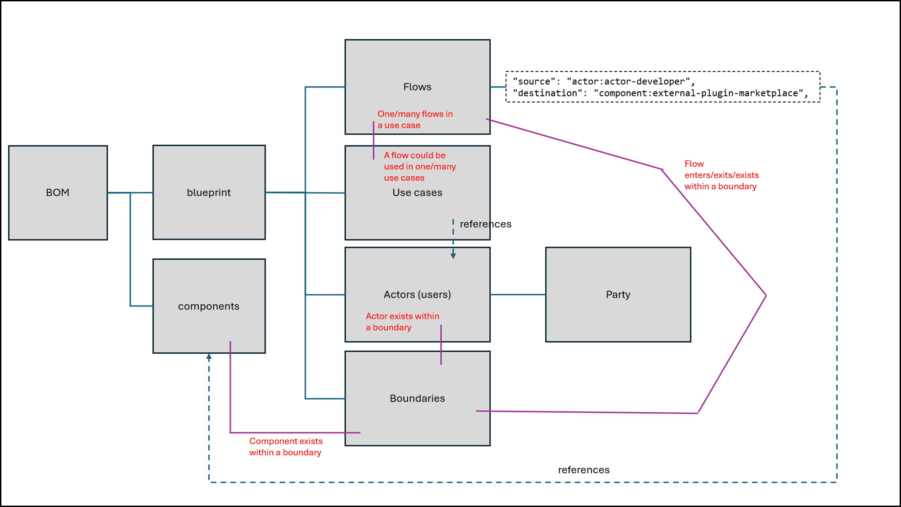

# Use Case: Code Assistant

This document provides concise definitions of the items used in threat modeling diagram.

Diagram (draw.io): 

[Edit this diagram (draw.io XML)](./diagram/ai_code_generator_threat_model_diagram_updated_2026_05_12.drawio)

## Overview

The **Code Assistant** use case describes an AI-powered development assistant that is surfaced to a developer directly inside an Integrated Development Environment (IDE). The assistant is installed as a **model plugin** — a first-class IDE extension that embeds agent capabilities into the editing experience without requiring the developer to switch context to a separate application.

### Local agents (in-IDE runtime)

Once the plugin is installed, a **Code Assistant Agent** (local, dynamic) runs within the plugin process on the developer's workstation. Before installation it is treated as a static software component (the *Code Assistant Plugin*); once activated inside the IDE it becomes an actor with agency.
- When hardware permits, a locally quantized language model (e.g., an 8B parameter model) serves inference entirely on the workstation, keeping code and context within the local trust boundary.
- *Local* indicates that the agent and its agentic framework run entirely on the developer's workstation, within the internal trust boundary.
- *Dynamic* indicates that the agent can take autonomous actions — tool calling, invoking MCP servers, and orchestrating multi-step workflows — rather than merely responding to single-turn prompts. The agent handles the full range of tasks from low-latency inline completions through to complex, multi-step operations such as autonomous code generation, repository-wide refactoring, and test scaffolding.

### External connectivity

The plugin and its local agents reach outward through standardized agent protocols — primarily the **Model Context Protocol (MCP)** — to two categories of external endpoint:

1. **Large-model services.** When a task exceeds local model capacity, or when the deployment is configured to delegate the entire agentic framework to a hosted platform, the Code Assistant Agent connects to an **external SaaS agentic platform** via an MCP Gateway. The remote platform hosts a **Remote Code Assistant Agent** — an agent that is opaque to the developer and operates entirely within the External SaaS trust boundary — together with a larger or specialized language model, a remote RAG pipeline, and a remote context store. Results flow back through the MCP Gateway to the local plugin.

2. **Information and tooling services.** Agents can invoke any number of **MCP Servers** that expose capabilities as callable tools: internal enterprise services (code search, ticket systems, internal APIs), external cloud-provider APIs (infrastructure provisioning, container registries, secret managers), and data-retrieval endpoints. Each MCP Server acts as a controlled egress point, enforcing authentication, authorization, and audit logging before forwarding requests to the underlying service.

### Trust boundaries and deployment variants

Two named boundaries partition the architecture:

- **Internal boundary** — represents **locally networked resources**: the developer's workstation, the IDE, the Code Assistant Plugin and its embedded agent, the local agentic framework, and any MCP servers (e.g., a locally installed Jira MCP Server) that are reachable within the organization's local network. All components within this boundary are subject to the organization's own security controls.

- **External boundary** — represents **remotely networked services**: any service that is reached over the public internet or a remote network, including the Agentic SaaS platform (e.g., Claude Code, Cursor), the External Plugin Marketplace, and cloud-provider APIs. Components within this boundary operate under a third-party trust model; the organization has limited visibility into their internal behavior and data handling.

The architecture supports two primary deployment variants that share the same plugin surface but differ in where the agentic framework runs:

| Variant | Agentic framework | Model | Data residency |
|---------|------------------|-------|---------------|
| **Sub Use Case 1a** — Local, IDE Agent | Agentic Framework runs locally on the developer's workstation (within the **Internal** boundary) | Local (e.g., small, 8B parameter model) | Stays on-workstation; cloud calls only via explicit MCP |
| **Sub Use Case 1b** — Remote, SaaS Agent | Agentic Framework is hosted on a remote SaaS platform (within the **External** boundary), reached via MCP Gateway | Remote, hosted (e.g., large, 128B parameter model) | Leaves workstation via MCP Gateway to remote SaaS |

In both variants the developer's IDE remains the single point of interaction. Authentication and authorization services guard every outbound connection, and all agent tool invocations are intended to be logged and auditable regardless of where the agentic framework is hosted.

### CycloneDX 2.0

[CycloneDX](https://cyclonedx.org/) is an open standard for creating a Bill of Materials (BOM) - most commonly a Software Bill of Materials (SBOM) - that describes what components make up a piece of software. It is developed by the OWASP and is now an international standard, ECMA-424.



Sections below define the elements of the BOM, as shown in the diagram above:

 - [Blueprint](#cyclonedx-20--blueprint-identity)
 - [Boundaries](#cyclonedx-20--boundaries)
 - [Top-level useCase](#cyclonedx-20--top-level-usecase)
 - Sub Use Case 1a
   - [Sub Use Case 1a relationships](#cyclonedx-20--sub-use-case-1a-relationships)
   - [Sub Use Case 1a flows](#cyclonedx-20--sub-use-case-1a-flows)
   - [Sub Use Case 1a useCase](#cyclonedx-20--sub-use-case-1a-usecase)
 - Sub Use Case 1b
   - [Sub Use Case 1b relationships](#cyclonedx-20--sub-use-case-1b-relationships)
   - [Sub Use Case 1b flows](#cyclonedx-20--sub-use-case-1b-flows)
   - [Sub Use Case 1b useCase](#cyclonedx-20--sub-use-case-1b-usecase)
 - [Top-level useCase revisited](#cyclonedx-20--top-level-usecase-revisited)
 - [Actors encoding](#cyclonedx-20--actors-encoding)
 - [Components encoding](#cyclonedx-20--components-encoding)
 - [Code Assistant Threat Model BOM](#cyclonedx-v20--code-assistant-threat-model-bom)

### CycloneDX 2.0 — `blueprint` identity

A `blueprint` is a top-level element of any CycloneDX BOM that wishes to include its design: the actors, components, boundaries, flows, and use cases that describe how a system behaves. It appears inside a `blueprints` array at the root of the BOM, alongside the standard `components` array. All design elements — `actors`, `boundaries`, `flows`, `useCases`, and references to `components` — live *inside* the blueprint object rather than at the BOM root; `components` itself remains at the BOM root so that inventory tooling can discover every component regardless of whether a blueprint is present.

```json
{
  "bomFormat": "CycloneDX",
  "specVersion": "2.0",
  "version": 1,
  "components": [ "...defined in the components section below..." ],
  "blueprints": [
    {
      "bom-ref": "blueprint:code-assistant",
      "name": "Code Assistant",
      "description": "An AI-powered development assistant surfaced to a developer inside an IDE as a model plugin. The assistant embeds agent capabilities directly into the editing experience, supporting both a fully local deployment (Sub Use Case 1a) and a remote SaaS-hosted agentic framework (Sub Use Case 1b).",
      "modelTypes": [ "logical" ],
      "actors":      [ "...defined in the actors section below..." ],
      "boundaries":  [ "...defined in the boundaries section below..." ],
      "flows":       [ "...defined in the flows sections below..." ],
      "useCases":    [ "...defined in the use-case sections below..." ]
    }
  ]
}
```

### CycloneDX 2.0 — `boundaries`

```json
{
  "bom-ref": "blueprint:code-assistant",
  "boundaries": [
    {
      "bom-ref": "boundary:internal",
      "name": "Internal",
      "description": "Represents locally networked resources: the developer's workstation, the IDE, the Code Assistant Plugin and its embedded agent, the local agentic framework, and any MCP servers reachable within the organization's local network. All components within this boundary are subject to the organization's own security controls."
    },
    {
      "bom-ref": "boundary:external-saas",
      "name": "External SaaS",
      "description": "Represents remotely networked managed services: the Agentic SaaS platform (e.g., Claude Code, Cursor), the External Plugin Marketplace, and any third-party application services accessed over the public internet. Components within this boundary operate under a third-party trust model with limited organizational visibility."
    },
    {
      "bom-ref": "boundary:external-cloud",
      "name": "External Cloud",
      "description": "Represents remotely networked cloud infrastructure providers: AWS, GCP, Azure, and similar platforms accessed via MCP Servers. Components within this boundary are governed by the cloud provider's shared-responsibility model."
    }
  ]
}
```

### CycloneDX 2.0 — top-level `useCase`

The top-level use case groups both sub use cases and will reference the overview flows by `ref` once those flows are defined. The `flows` array is left empty here as a placeholder; see [Top-level `useCase` revisited](#cyclonedx-20--top-level-usecase-revisited) after the flows are fully defined for the complete populated version.

```json
{
  "bom-ref": "blueprint:code-assistant",
  "useCases": [
    {
      "bom-ref": "usecase:code-assistant",
      "name": "Code Assistant",
      "description": "A developer uses an AI-powered code assistant—composed of a plugin, one or more agents, a language model, a retrieval-augmented generation (RAG) pipeline, and an agentic framework—to accelerate software development tasks such as code generation, explanation, and review. The assistant may run fully on the developer's workstation (Sub Use Case 1a) or offload its agentic components to an external SaaS platform (Sub Use Case 1b).",
      "preconditions": [
        "Developer has an IDE installed and a local codebase clone available.",
        "The Code Assistant Plugin has been installed from a trusted, authenticated Plugin Marketplace (e.g., VS Code Marketplace, JetBrains Marketplace) whose publisher identity and plugin integrity are verified before delivery to the IDE.",
        "The installed Code Assistant Plugin is authenticated and authorized via the Authentication and Authorization Services.",
        "The MCP Server — Agentic SaaS (e.g., Claude Code, hosted remotely on the Agentic SaaS platform) is reachable from the developer's workstation.",
        "The locally installed MCP Server (e.g., a Jira MCP Server installed on the developer's workstation) is running and reachable."
      ],
      "postconditions": [
        "Developer receives AI-generated code suggestions, completions, or reviews.",
        "Any tool invocations performed by agents are logged and auditable.",
        "No sensitive code or credentials are unintentionally exfiltrated."
      ],
      "exceptions": [
        {
          "name": "Authentication Failure",
          "condition": "The Authentication Service rejects the Developer's credentials or token.",
          "description": "The developer cannot authenticate, preventing plugin activation.",
          "handling": "The plugin displays an authentication error; the developer is prompted to re-authenticate or contact an administrator."
        },
        {
          "name": "MCP Server Unreachable",
          "condition": "An internal or external MCP Server is unavailable or returns a connection error.",
          "description": "Tool calls from the agent cannot be completed, potentially stalling multi-step workflows.",
          "handling": "The agent reports the tool failure to the developer and falls back to model-only responses where possible."
        },
        {
          "name": "Prompt Injection Detected",
          "condition": "Malicious content in the codebase, context store, or RAG output attempts to redirect agent behavior.",
          "description": "An injected instruction overrides the developer's intent, potentially causing unauthorized tool invocations or data exfiltration.",
          "handling": "The agentic framework applies input sanitization; suspicious instructions are flagged and execution is halted pending developer review."
        }
      ],
      "successCriteria": [
        "Developer receives accurate, contextually relevant code suggestions or completions.",
        "All agent tool invocations are authorized and within the defined permission scope.",
        "No sensitive data (credentials, proprietary code) is transmitted to unauthorized endpoints.",
        "Audit logs capture all agent actions and external service calls."
      ],
      "notes": [
        "This top-level use case is realized by two sub use cases (1a and 1b) that differ in the deployment location of the Agentic Framework and its hosted components."
      ],
      "flows": [
        { "ref": "flow:developer-installs-plugin" },
        { "ref": "flow:developer-activates-plugin" },
        { "ref": "flow:agent-authenticates" },
        { "ref": "flow:agent-queries-codebase" },
        { "ref": "flow:agent-delegates-to-dynamic" },
        { "ref": "flow:dynamic-agent-invokes-model" },
        { "ref": "flow:model-returns-response" }
      ]
    }
  ]
}
```

**Note:** Flows will be defined in Sub Use Cases 1a and 1b — see the revisited snippet below

---

## Sub Use Case 1a

The developer's workstation hosts the full agentic framework, including the dynamic agent, model, RAG, and context store. The assistant plugin communicates directly with locally running components, with MCP servers bridging internal third-party services and external cloud platforms.

<!-- ```
Internal
├── MCP Server
│   └── Third Party Service
├── Authn/Authz
└── Workstation
    ├── IDE
    ├── Local Codebase Clone
    ├── Code Assistant Plugin
    │   └── Code Assistant Agent
    └── Agentic Framework
        ├── Code Assistant Agent (local, dynamic)
        ├── Code Assistant Model (e.g. 8b)
        ├── RAG
        └── Context Store

External Cloud
└── MCP Server
    └── Cloud Service
```-->

### CycloneDX 2.0 — Sub Use Case 1a relationships

The structural containment expressed in the ASCII diagram above, encoded using the blueprint `relationship` object. Each entry in `relationships` has a single subject (`ref`) and one typed relationship property whose value lists the targets.

Relationship semantics used:
- **`aggregates`** — the subject is the whole of a loose whole-part grouping (boundary → top-level members that can exist independently of that boundary).
- **`composes`** — the subject is the whole of a strong whole-part grouping (a component whose parts cannot meaningfully exist without it at runtime).
- **`contains`** — the subject directly nests or hosts the target (a component that wraps or embeds another).

```json
{
  "bom-ref": "blueprint:code-assistant",
  "relationships": [
    {
      "ref": "boundary:internal",
      "aggregates": [
        "component:mcp-server-third-party",
        "component:authn-service",
        "component:authz-service",
        "component:local-ide",
        "component:data-local-codebase",
        "component:code-asst-plugin",
        "component:internal-agentic-framework"
      ]
    },
    {
      "ref": "component:code-asst-plugin",
      "contains": [
        "component:code-asst-agent"
      ]
    },
    {
      "ref": "component:internal-agentic-framework",
      "composes": [
        "actor:local-code-asst-agent",
        "component:code-assistant-model-local",
        "component:rag-local",
        "component:context-store-local"
      ]
    },
    {
      "ref": "boundary:external-cloud",
      "aggregates": [
        "component:mcp-cloud"
      ]
    },
    {
      "ref": "component:mcp-cloud",
      "contains": [
        "component:cloud-service"
      ]
    }
  ]
}
```

### CycloneDX 2.0 — Sub Use Case 1a flows

Flows specific to the fully local agentic framework deployment.

```json
{
  "bom-ref": "blueprint:code-assistant",
  "flows": [
    {
      "bom-ref": "flow:1a:developer-submits-request",
      "name": "Developer submits coding request",
      "description": "The Developer submits a coding request through the IDE to the Code Assistant Plugin.",
      "type": "process",
      "source": "actor:developer",
      "destination": "component:code-asst-plugin",
      "sequence": 1
    },
    {
      "bom-ref": "flow:1a:agent-authenticates",
      "name": "Code Assistant Agent authenticates and authorizes",
      "description": "The Code Assistant Agent authenticates and authorizes the request via the Authentication Service and Authorization Service.",
      "type": "control",
      "source": "component:code-asst-agent",
      "destination": "component:authn-service",
      "sequence": 2
    },
    {
      "bom-ref": "flow:1a:agent-delegates-to-dynamic",
      "name": "Code Assistant Agent delegates to local agentic framework",
      "description": "The Code Assistant Agent evaluates the request and, for complex tasks, delegates to the local agent (local, dynamic) within the local Agentic Framework.",
      "type": "control",
      "source": "component:code-asst-agent",
      "destination": "actor:local-code-asst-agent",
      "sequence": 3
    },
    {
      "bom-ref": "flow:1a:dynamic-agent-invokes-model",
      "name": "Local agent orchestrates local model",
      "description": "The local agent (local, dynamic) orchestrates the Local Code Assistant Model and Local Context Store to enrich the prompt.",
      "type": "process",
      "source": "actor:local-code-asst-agent",
      "destination": "component:code-assistant-model-local",
      "sequence": 4
    },
    {
      "bom-ref": "flow:1a:dynamic-agent-calls-mcp",
      "name": "Local agent calls MCP Server",
      "description": "If external data or service integration is required, the local agent (local, dynamic) calls the Third Party MCP Server or the MCP Server — Cloud Service.",
      "type": "control",
      "source": "actor:local-code-asst-agent",
      "destination": "component:mcp-server-third-party",
      "sequence": 5
    },
    {
      "bom-ref": "flow:1a:model-returns-response",
      "name": "Local model returns response to Developer",
      "description": "The Local Code Assistant Model generates the response, which is returned through the Agentic Framework and Code Assistant Plugin to the Developer in the IDE.",
      "type": "data",
      "source": "component:code-assistant-model-local",
      "destination": "actor:developer",
      "sequence": 6
    }
  ]
}
```

### CycloneDX 2.0 — Sub Use Case 1a `useCase`

```json
{
  "bom-ref": "blueprint:code-assistant",
  "useCases": [
    {
      "bom-ref": "usecase:code-assistant-1a",
      "name": "Code Assistant — Sub Use Case 1a (Local Agentic Framework)",
      "description": "The developer's workstation hosts the full agentic framework, including the dynamic agent, model, RAG pipeline, and context store. The assistant plugin communicates directly with locally running components. MCP Servers bridge internal third-party services and external cloud platforms.",
      "preconditions": [
        "The developer's workstation has sufficient resources to run the local Code Assistant Model (e.g., an 8B-parameter model).",
        "The Agentic Framework, RAG pipeline, and Context Store are installed and running locally.",
        "The Code Assistant Plugin is installed in the IDE and authenticated.",
        "Internal MCP Server and relevant Third Party Services are reachable.",
        "External Cloud MCP Server is reachable if cloud service integrations are required."
      ],
      "postconditions": [
        "Developer receives AI-generated code suggestions produced by the locally hosted model.",
        "All data—including codebase content and context—remains within the internal network boundary unless explicitly forwarded via MCP to an external cloud service.",
        "Agent tool invocations are logged locally."
      ],
      "exceptions": [
        {
          "name": "Insufficient Local Resources",
          "condition": "The workstation does not have enough CPU/GPU/RAM to run the local model.",
          "description": "Model inference fails or produces degraded responses due to resource constraints.",
          "handling": "The framework reports an error to the developer; the developer may reduce model size or free system resources."
        },
        {
          "name": "Context Store Poisoning",
          "condition": "Malicious or manipulated content is present in the Local Context Store.",
          "description": "Poisoned retrieval data is injected into the model prompt, potentially altering agent behavior.",
          "handling": "The RAG pipeline applies content validation; suspicious documents are flagged and excluded from context assembly."
        }
      ],
      "successCriteria": [
        "Code suggestions are generated entirely within the internal trust boundary.",
        "No developer code or credentials are transmitted to unapproved external endpoints.",
        "Agent tool calls are restricted to permitted MCP Servers.",
        "Local model inference completes within an acceptable latency threshold."
      ],
      "notes": [
        "This sub use case is characterized by a fully local agentic stack — the dynamic agent, model, RAG, and context store all run on the developer's workstation.",
        "MCP Servers act as the sole egress path to third-party and cloud services."
      ],
      "flows": [
        { "ref": "flow:1a:developer-submits-request" },
        { "ref": "flow:1a:agent-authenticates" },
        { "ref": "flow:1a:agent-delegates-to-dynamic" },
        { "ref": "flow:1a:dynamic-agent-invokes-model" },
        { "ref": "flow:1a:dynamic-agent-calls-mcp" },
        { "ref": "flow:1a:model-returns-response" }
      ]
    }
  ]
}
```

---

## Sub Use Case 1b

The agentic framework is offloaded to an external SaaS platform, which hosts the dynamic agent, model, RAG, and context store behind an MCP Gateway. The workstation retains the plugin and local agent, with MCP servers connecting to both internal third-party services and external cloud platforms.

<!-- ```
Internal
├── MCP Server
│   └── Third Party Service (e.g. Jira, GitHub)
├── Authn/Authz
└── Workstation
    ├── IDE
    ├── Local Codebase Clone
    ├── Code Assistant Plugin
    │   └── Code Assistant Agent
    └── Agentic Framework (stub — agentic execution delegated to External SaaS)

External SaaS
├── Plugin Marketplace
└── Agentic SaaS
    ├── MCP Gateway
    └── MCP Server (e.g. Claude Code)
        ├── Remote Code Assistant Agent
        ├── Code Assistant Model (e.g. 30b)
        ├── RAG
        └── Context store

External Cloud
└── MCP Server
    └── Cloud Service (e.g. AWS, GCP)
``` -->

### CycloneDX 2.0 — Sub Use Case 1b relationships

The structural containment expressed in the ASCII diagram above, encoded using the blueprint `relationship` object. The same three relationship semantics apply as in Sub Use Case 1a; note that `boundary:external-saas` and `component:agentic-saas` introduce their own containment hierarchy in this variant.

```json
{
  "bom-ref": "blueprint:code-assistant",
  "relationships": [
    {
      "ref": "boundary:internal",
      "aggregates": [
        "component:mcp-server-third-party",
        "component:authn-service",
        "component:authz-service",
        "component:local-ide",
        "component:data-local-codebase",
        "component:code-asst-plugin",
        "component:external-saas-agentic-framework"
      ]
    },
    {
      "ref": "component:code-asst-plugin",
      "contains": [
        "component:code-asst-agent"
      ]
    },
    {
      "ref": "boundary:external-saas",
      "aggregates": [
        "component:external-plugin-marketplace",
        "component:agentic-saas"
      ]
    },
    {
      "ref": "component:agentic-saas",
      "composes": [
        "component:mcp-gateway",
        "component:mcp-agentic-saas"
      ]
    },
    {
      "ref": "component:mcp-agentic-saas",
      "composes": [
        "actor:remote-code-asst-agent",
        "component:code-assistant-model-remote",
        "component:rag-remote",
        "component:context-store-remote"
      ]
    },
    {
      "ref": "boundary:external-cloud",
      "aggregates": [
        "component:mcp-cloud"
      ]
    },
    {
      "ref": "component:mcp-cloud",
      "contains": [
        "component:cloud-service"
      ]
    }
  ]
}
```

### CycloneDX 2.0 — Sub Use Case 1b flows

Flows specific to the external SaaS agentic framework deployment.

```json
{
  "bom-ref": "blueprint:code-assistant",
  "flows": [
    {
      "bom-ref": "flow:1b:developer-installs-plugin",
      "name": "Developer installs Code Assistant Plugin from Marketplace",
      "description": "The Developer installs the Code Assistant Plugin from the External Plugin Marketplace and opens it within the IDE.",
      "type": "process",
      "source": "actor:developer",
      "destination": "component:external-plugin-marketplace",
      "sequence": 1
    },
    {
      "bom-ref": "flow:1b:agent-authenticates",
      "name": "Code Assistant Agent authenticates and authorizes",
      "description": "The Code Assistant Agent authenticates and authorizes the request via the Authentication Service and Authorization Service.",
      "type": "control",
      "source": "component:code-asst-agent",
      "destination": "component:authn-service",
      "sequence": 2
    },
    {
      "bom-ref": "flow:1b:agent-forwards-to-gateway",
      "name": "Code Assistant Agent forwards request to MCP Gateway",
      "description": "The Code Assistant Agent evaluates the request and forwards complex tasks to the Agentic SaaS platform via the MCP Gateway.",
      "type": "control",
      "source": "component:code-asst-agent",
      "destination": "component:mcp-gateway",
      "sequence": 3
    },
    {
      "bom-ref": "flow:1b:gateway-routes-to-saas",
      "name": "MCP Gateway routes request to MCP Server — Agentic SaaS",
      "description": "The MCP Gateway authenticates the inbound request and routes it to the MCP Server — Agentic SaaS.",
      "type": "control",
      "source": "component:mcp-gateway",
      "destination": "component:mcp-agentic-saas",
      "sequence": 4
    },
    {
      "bom-ref": "flow:1b:remote-agent-invokes-model",
      "name": "Remote Code Assistant Agent orchestrates remote model",
      "description": "The Remote Code Assistant Agent orchestrates the Remote Code Assistant Model, Remote RAG, and Remote Context Store.",
      "type": "process",
      "source": "actor:remote-code-asst-agent",
      "destination": "component:code-assistant-model-remote",
      "sequence": 5
    },
    {
      "bom-ref": "flow:1b:remote-agent-calls-mcp",
      "name": "Remote Code Assistant Agent calls MCP Server",
      "description": "If external service integration is required, the Remote Code Assistant Agent calls the Third Party MCP Server or the MCP Server — Cloud Service.",
      "type": "control",
      "source": "actor:remote-code-asst-agent",
      "destination": "component:mcp-server-third-party",
      "sequence": 6
    },
    {
      "bom-ref": "flow:1b:model-returns-response",
      "name": "Remote model returns response to Developer",
      "description": "The Remote Code Assistant Model generates the response, which is returned via the MCP Gateway and Code Assistant Plugin to the Developer in the IDE.",
      "type": "data",
      "source": "component:code-assistant-model-remote",
      "destination": "actor:developer",
      "sequence": 7
    }
  ]
}
```

### CycloneDX 2.0 — Sub Use Case 1b `useCase`

```json
{
  "bom-ref": "blueprint:code-assistant",
  "useCases": [
    {
      "bom-ref": "usecase:code-assistant-1b",
      "name": "Code Assistant — Sub Use Case 1b (External SaaS Agentic Framework)",
      "description": "The agentic framework is offloaded to an external SaaS platform, which hosts the dynamic agent, model, RAG pipeline, and context store behind an MCP Gateway. The workstation retains the Code Assistant Plugin and local agent. MCP Servers connect to both internal third-party services and external cloud platforms. The Plugin Marketplace is the source for plugin installation.",
      "preconditions": [
        "The Code Assistant Plugin is installed from the External Plugin Marketplace and is authenticated.",
        "The Agentic SaaS platform is accessible and the developer's account is provisioned.",
        "The MCP Gateway on the Agentic SaaS platform is reachable from the developer's workstation.",
        "Internal MCP Server and relevant Third Party Services (e.g., Jira, GitHub) are reachable.",
        "External Cloud MCP Server is reachable if cloud service integrations are required."
      ],
      "postconditions": [
        "Developer receives AI-generated code suggestions produced by the remotely hosted model.",
        "Developer code and context submitted to the SaaS platform are governed by the platform's data handling and retention policies.",
        "Agent tool invocations on the SaaS side are logged by the platform."
      ],
      "exceptions": [
        {
          "name": "Agentic SaaS Platform Unavailable",
          "condition": "The Agentic SaaS platform or MCP Gateway is unreachable due to an outage or network failure.",
          "description": "The developer cannot complete multi-step agentic tasks; the plugin degrades to static-only responses.",
          "handling": "The Code Assistant Agent (local, dynamic) notifies the developer of the degraded state and provides best-effort responses without SaaS delegation."
        },
        {
          "name": "Malicious Plugin from Marketplace",
          "condition": "A plugin installed from the External Plugin Marketplace contains malicious code.",
          "description": "The plugin exfiltrates developer credentials, codebase content, or manipulates agent outputs.",
          "handling": "The Authentication and Authorization Services should enforce least-privilege; organizations should vet plugins prior to installation and monitor plugin network activity."
        },
        {
          "name": "Data Exfiltration via SaaS",
          "condition": "Code or context submitted to the Agentic SaaS platform is accessed or retained in violation of data handling agreements.",
          "description": "Sensitive proprietary code or secrets are exposed to the SaaS provider or third parties.",
          "handling": "Organizations should review SaaS data retention policies, apply code redaction where possible, and avoid submitting secrets or regulated data to external platforms."
        },
        {
          "name": "Prompt Injection via Remote Context Store",
          "condition": "Malicious content ingested into the Remote Context Store or Remote RAG pipeline redirects the remote agent's behavior.",
          "description": "An injected instruction overrides the developer's intent, potentially causing unauthorized tool invocations or data exfiltration from the SaaS platform.",
          "handling": "The SaaS platform and agentic framework apply input sanitization; suspicious instructions are flagged and execution is halted pending developer review."
        }
      ],
      "successCriteria": [
        "Developer receives accurate code suggestions from the remote model within acceptable latency.",
        "All data transmitted to the Agentic SaaS platform is governed by agreed data handling policies.",
        "Agent tool calls are restricted to permitted internal and external MCP Servers.",
        "Plugin integrity is verified prior to installation and during runtime."
      ],
      "notes": [
        "This sub use case introduces a third-party trust boundary at the Agentic SaaS platform, which hosts the most capable (e.g., 30B-parameter) model.",
        "The External Plugin Marketplace is a supply chain risk vector — plugins should be vetted and sourced from trusted publishers.",
        "MCP Gateway acts as the sole ingress point to the SaaS agentic stack and is a high-value target."
      ],
      "flows": [
        { "ref": "flow:1b:developer-installs-plugin" },
        { "ref": "flow:1b:agent-authenticates" },
        { "ref": "flow:1b:agent-forwards-to-gateway" },
        { "ref": "flow:1b:gateway-routes-to-saas" },
        { "ref": "flow:1b:remote-agent-invokes-model" },
        { "ref": "flow:1b:remote-agent-calls-mcp" },
        { "ref": "flow:1b:model-returns-response" }
      ]
    }
  ]
}
```

### CycloneDX 2.0 — top-level `useCase` revisited

Now that the sub-use-case flows have been defined above, the top-level `useCase` can be updated to reference them. The `flows` array below shows the complete set of flow references that belong on the parent use case once all flows exist in the BOM.

```json
{
  "bom-ref": "blueprint:code-assistant",
  "useCases": [
    {
      "bom-ref": "usecase:code-assistant",
      "flows": [
        { "ref": "flow:developer-installs-plugin" },
        { "ref": "flow:developer-activates-plugin" },
        { "ref": "flow:agent-authenticates" },
        { "ref": "flow:agent-queries-codebase" },
        { "ref": "flow:agent-delegates-to-dynamic" },
        { "ref": "flow:dynamic-agent-invokes-model" },
        { "ref": "flow:model-returns-response" }
      ]
    }
  ]
}
```

---

## Actors and Components

The sections below define every actor and component that appears in the architecture. These are the **ingredients** from which flows and use cases are assembled. The taxonomy is aligned to CycloneDX component types as defined in [CycloneDX 1.7/2.0+](https://cyclonedx.org/docs/1.7/json/#metadata_tools_oneOf_i0_components_items_type).

**Note:** Parties/Roles to cover the Threat Modeling concept of Actors are available from CycloneDX 2.0.

### Actors (Parties/Roles)

Humans or systems that initiate or receive actions.

- **Developer**
  The human actor who writes, modifies, and maintains code — considered a potential target (e.g., phishing, credential theft) or source of risk (e.g., introducing vulnerabilities or misconfigurations).

  Example: A backend engineer, a DevOps engineer, a security engineer, a contractor with repo access.

- **Code Assistant Agent** (local, dynamic)
  The agent delivered as part of the Code Assistant Plugin. Before installation the plugin is a static software component; once activated inside the IDE the embedded agent becomes an actor with agency over the developer environment. *Local* affirms that the agent and its agentic framework run entirely on the developer's workstation within the internal trust boundary. *Dynamic* affirms that the agent can take autonomous actions — tool calling, invoking MCP servers, and orchestrating multi-step workflows — rather than merely responding to single-turn prompts. It handles tasks ranging from low-latency inline completions through to complex multi-step operations such as autonomous code generation and test scaffolding. A context store is available for structured state across workflow steps. A RAG pipeline component exists in the architecture but is not exercised in the current use case variants and is deferred for later consideration. In threat modeling this actor is treated as an active participant with an expanded blast radius — its autonomous, multi-tool operation makes it susceptible to prompt injection, workflow hijacking, and cascading misuse of integrated services accessible via MCP.

  Example: GitHub Copilot (in-IDE agent), Amazon Q Developer (in-IDE agent), Continue with Ollama, Aider with a locally hosted model, OpenHands with a local LLM

- **Remote Code Assistant Agent** (remote, dynamic)
  An agent hosted entirely within the External SaaS trust boundary, opaque to the developer beyond its API surface. *Remote* affirms that the agent and its agentic framework operate outside the developer's workstation, within a third-party platform. *Dynamic* affirms that the agent can take autonomous actions — tool calling, invoking MCP servers, and orchestrating multi-step workflows — rather than merely responding to single-turn prompts. It may have access to additional tools, skills, and service connectors not individually enumerated in this use case. In threat modeling this actor is treated as an active participant with a broad blast radius — its external hosting introduces risks around data exfiltration, third-party data handling, prompt injection via remote context, and limited developer visibility into its internal operations.

  Example: Claude Code (Anthropic), Cursor Agent, Devin (Cognition AI)

#### CycloneDX 2.0 — `actors` encoding

```json
{
  "bom-ref": "blueprint:code-assistant",
  "actors": [
    {
      "bom-ref": "actor:developer",
      "party": {
        "roles": [
          { "role": "developer" }
        ],
        "persona": {
          "archetype": "developer",
          "scope": "internal",
          "description": "Human actor who writes, modifies, and maintains code—considered a potential target (e.g., phishing, credential theft) or source of risk (e.g., introducing vulnerabilities or misconfigurations)."
        }
      },
      "description": "The human developer who interacts with the code assistant within the IDE."
    },
    {
      "bom-ref": "actor:local-code-asst-agent",
      "party": {
        "roles": [
          { "role": "agent" }
        ],
        "system": {
          "kind": "agent",
          "permissions": [
            "invoke-ide-apis",
            "read-local-codebase",
            "call-llm-inference-endpoint",
            "invoke-local-mcp-servers",
            "orchestrate-multi-step-workflows",
            "read-write-local-context-store"
          ]
        }
      },
      "description": "The agent (local, dynamic) delivered as part of the Code Assistant Plugin. Operates as a static component prior to installation; once activated in the IDE it becomes an actor with agency over the developer environment. Local: the agent and its agentic framework run entirely on the developer's workstation within the internal trust boundary. Dynamic: the agent can take autonomous actions — tool calling, invoking MCP servers, and orchestrating multi-step workflows. A context store is available for structured state across steps. A RAG pipeline exists in the architecture but is not exercised in the current use case variants and is deferred for later consideration. Susceptible to prompt injection, workflow hijacking, and cascading misuse of MCP-accessible services."
    },
    {
      "bom-ref": "actor:remote-code-asst-agent",
      "party": {
        "roles": [
          { "role": "agent" }
        ],
        "system": {
          "kind": "agent",
          "permissions": [
            "orchestrate-multi-step-workflows",
            "invoke-external-services",
            "invoke-remote-mcp-servers"
          ]
        }
      },
      "description": "The agent (remote, dynamic) hosted entirely within the External SaaS trust boundary, opaque to the developer beyond its API surface. Remote: the agent and its agentic framework operate outside the developer's workstation within a third-party platform. Dynamic: the agent can take autonomous actions — tool calling, invoking MCP servers, and orchestrating multi-step workflows. May access additional tools, skills, and connectors not enumerated in this use case. Susceptible to prompt injection via remote context, third-party data handling risks, and limited developer visibility into its internal operations."
    }
  ]
}
```

### Components

#### Group (Trust Boundaries)

Used to describe the control zones of an organization relative to the use cases.

- **Internal**
  The **local network boundary**. Contains systems, APIs, or infrastructure that are locally reachable within the organization's own network — the developer's workstation, on-premises services, and locally installed MCP servers. Components here are governed by the organization's own security controls and are generally more trusted, but still pose risks such as misconfigurations, lateral movement, and insider threats.

  Example: Developer workstation, self-hosted GitLab, locally installed Jira MCP Server, on-prem Jenkins CI

- **External SaaS**
  The **remote network boundary** for managed SaaS services. Contains third-party software platforms that are accessed over the public internet or a remote network and provide application or agentic capabilities — including the Agentic SaaS platform that hosts the Remote Code Assistant Agent. Components here operate under a third-party trust model and introduce additional risks including supply chain vulnerabilities, data exposure, and limited visibility or control over security practices.

  Example: Claude Code (Anthropic), Cursor, GitHub Copilot Workspace, Slack

- **External Cloud**
  The **remote network boundary** for cloud infrastructure providers. Contains third-party infrastructure and cloud service providers used as execution targets or data stores, accessed remotely via MCP Servers. Introduce additional risks including supply chain vulnerabilities, data exposure, and limited visibility or control over security practices.

  Example: AWS, Google Cloud Platform (GCP), Microsoft Azure

#### Data

Data at rest or data in motion.

- **Code Assistant Plugin** (`component:code-asst-plugin`)
  A compromised or intentionally malicious AI-powered IDE plugin that appears to assist with coding but performs unauthorized actions — introducing risks such as data exfiltration, credential harvesting, backdoor insertion, or manipulation of code and outputs.

  Example: Malicious fake ESLint extension, trojanized Prettier plugin

- **Local Codebase Clone** (`component:data-local-codebase`)
  A developer's local copy of a repository — treated as a sensitive asset since it may contain proprietary code, secrets, or configurations that could be exposed if the endpoint is compromised.

  Example: local monorepo checkout

- **Local Context Store** (`component:context-store-local`)
  A locally hosted data store that supplies structured or unstructured content to the model or retrieval pipeline to enrich responses. Risks include unauthorized access to sensitive stored content, poisoning of the data corpus, and data leakage via model outputs.

  Example: Local Chroma DB, local FAISS index

- **Remote Context Store** (`component:context-store-remote`)
  A remotely hosted data store that supplies structured or unstructured content to the model or retrieval pipeline to enrich responses. Risks include unauthorized access to sensitive stored content, poisoning of the data corpus, and data leakage via model outputs.

  Example: Pinecone, Weaviate

#### Application

- **Integrated Development Environment (IDE)** (`component:local-ide`)
  The software environment where code is written and tested — an attack surface due to risks like malicious extensions, insecure settings, or credential exposure.

  Example: VS Code, JetBrains IntelliJ IDEA, Google Antigravity IDE

- **Authentication Service** (`component:authn-service`)
  The service for verifying the identity of a user or system — risks include credential theft, weak authentication mechanisms, and session hijacking.

  Example: Okta, Microsoft Entra ID, AWS Cognito

- **Authorization Service** (`component:authz-service`)
  The service for determining what an authenticated user or system is allowed to access or perform — risks include excessive permissions, privilege escalation, and misconfigured access controls.

  Example: Open Policy Agent (OPA), AWS IAM, HashiCorp Boundary

- **Third Party MCP Server** (`component:mcp-server-third-party`)
  An organization-operated MCP server that integrates the assistant with internal third-party services. Poses risks if misconfigured or inadequately secured, including unauthorized data access, insecure API exposure, and privilege escalation through service integrations.

  Example: Internal MCP server bridging Jira, Confluence

- **Code Assistant Agent** *(as a component — prior to activation as an actor)* (`component:code-asst-agent`)
  Before the Code Assistant Plugin is installed and activated, the embedded agent is modeled as a static application component. Once activated inside the IDE it transitions to an actor (`actor:local-code-asst-agent`). As a component it is subject to supply chain risks: a compromised plugin binary may carry a malicious agent payload.

- **Local RAG** (`component:rag-local`)
  A component, hosted locally, that dynamically fetches relevant content from available data sources to augment the model's context and improve response quality. Introduces risks around ingestion of untrusted or manipulated content, exposure of sensitive data through retrieval, and injection of malicious inputs that propagate into model outputs.

  Example: Local LangChain + Chroma, LlamaIndex + FAISS

- **Remote RAG** (`component:rag-remote`)
  A component, hosted remotely, that dynamically fetches relevant content from available data sources to augment the model's context and improve response quality. Introduces risks around ingestion of untrusted or manipulated content, exposure of sensitive data through retrieval, and injection of malicious inputs that propagate into model outputs.

  Example: Hosted LangChain + Pinecone, Haystack + Weaviate

- **MCP Server — Cloud Service** (`component:mcp-cloud`)
  A vendor-operated MCP server that integrates the assistant with external cloud platforms and services. Introduces supply chain risks including vulnerable or malicious dependencies, excessive permissions, and potential exfiltration of data passed through the integration.

  Example: AWS S3 MCP integration, Google Drive MCP connector

- **MCP Server — Agentic SaaS** (`component:mcp-agentic-saas`)
  The MCP server component hosted within the Agentic SaaS platform, responsible for exposing assistant capabilities and orchestrating downstream agent, model, and retrieval components. A high-value target due to its central role — risks include unauthorized access, data interception, and abuse of its broad orchestration capabilities.

  Example: Cursor cloud MCP layer, GitHub Copilot Workspace MCP backend

- **MCP Gateway** (`component:mcp-gateway`)
  The ingress service (e.g., proxy, API gateway, or firewall) that receives and routes inbound connections to the assistant backend. Acts as a perimeter trust boundary — misconfiguration or compromise can expose backend infrastructure to unauthorized access or traffic manipulation.

  Example: AWS API Gateway, Nginx reverse proxy, Cloudflare Tunnel

#### Platform

- **External Plugin Marketplace** (`component:external-plugin-marketplace`)
  An externally operated third-party platform where developers discover and install IDE plugins or extensions — introduces supply chain risks such as malicious or vulnerable plugins, insufficient vetting, and potential for unauthorized data access or exfiltration.

  Example: VS Code Marketplace, JetBrains Marketplace, Chrome Web Store

- **Agentic SaaS** (`component:agentic-saas`)
  An externally operated platform that delivers agentic assistant capabilities as a managed service. Introduces risks related to third-party data handling, limited visibility into model behavior and data flows, dependency on external availability, and reduced control over security posture.

  Example: Cursor, GitHub Copilot Workspace

#### Framework

- **Agentic Framework (Internal)** (`component:internal-agentic-framework`)
  The orchestration layer, running locally on the developer's workstation, that coordinates multi-step, tool-using workflows on behalf of the assistant. Manages execution flow between the model, retrieval systems, and external services — a high-impact trust boundary where prompt injection, tool misuse, or unintended action chains can have significant consequences.

  Example: LangChain, CrewAI, Anthropic Agents SDK

- **Agentic Framework (External SaaS)** (`component:external-saas-agentic-framework`)
  The orchestration layer, hosted on the external SaaS platform, that coordinates multi-step, tool-using workflows on behalf of the remote agent. Operates entirely within the third-party trust boundary; the organization has limited visibility into its execution.

  Example: Cursor cloud agent runtime, GitHub Copilot Workspace agent

#### Machine-Learning-Model

- **Code Assistant Model (Local)** (`component:code-assistant-model-local`)
  The core AI model that generates responses or code suggestions. Run locally (e.g., a self-hosted model). Relevant in threat modeling due to risks like prompt injection, data leakage, model manipulation, and insecure output generation. This is a component within the Agent.

  Example: Ollama + CodeLlama 13B, self-hosted Mistral 7B

- **Code Assistant Model (Remote)** (`component:code-assistant-model-remote`)
  The core AI model that generates responses or code suggestions. Run remotely (e.g., a cloud-hosted model such as a 30B-parameter model). Relevant in threat modeling due to risks like prompt injection, data leakage, model manipulation, and insecure output generation. This is a component within the Agent.

  Example: Claude Sonnet (Anthropic API), GPT-4o (Azure OpenAI), Llama 3 70B (Amazon Bedrock)

#### CycloneDX 2.0 — `components` encoding

```json
{
  "bom-ref": "blueprint:code-assistant",
  "components": [
    {
      "type": "device",
      "bom-ref": "actor:developer",
      "name": "Developer"
    },
    {
      "type": "application",
      "bom-ref": "component:local-ide",
      "name": "Integrated Development Environment (IDE)"
    },
    {
      "type": "data",
      "bom-ref": "component:code-asst-plugin",
      "name": "Code Assistant Plugin"
    },
    {
      "type": "data",
      "bom-ref": "component:data-local-codebase",
      "name": "Local Codebase Clone"
    },
    {
      "type": "application",
      "bom-ref": "component:authn-service",
      "name": "Authentication Service"
    },
    {
      "type": "application",
      "bom-ref": "component:authz-service",
      "name": "Authorization Service"
    },
    {
      "type": "application",
      "bom-ref": "component:mcp-server-third-party",
      "name": "Third Party MCP Server"
    },
    {
      "type": "application",
      "bom-ref": "component:code-asst-agent",
      "name": "Code Assistant Agent"
    },
    {
      "type": "application",
      "bom-ref": "actor:local-code-asst-agent",
      "name": "Code Assistant Agent (local, dynamic)"
    },
    {
      "type": "application",
      "bom-ref": "actor:remote-code-asst-agent",
      "name": "Remote Code Assistant Agent (remote, dynamic)"
    },
    {
      "type": "framework",
      "bom-ref": "component:internal-agentic-framework",
      "name": "Agentic Framework (Internal)"
    },
    {
      "type": "framework",
      "bom-ref": "component:external-saas-agentic-framework",
      "name": "Agentic Framework (External SaaS)"
    },
    {
      "type": "machine-learning-model",
      "bom-ref": "component:code-assistant-model-local",
      "name": "Local Code Assistant Model"
    },
    {
      "type": "machine-learning-model",
      "bom-ref": "component:code-assistant-model-remote",
      "name": "Remote Code Assistant Model"
    },
    {
      "type": "application",
      "bom-ref": "component:rag-local",
      "name": "Local RAG"
    },
    {
      "type": "application",
      "bom-ref": "component:rag-remote",
      "name": "Remote RAG"
    },
    {
      "type": "data",
      "bom-ref": "component:context-store-local",
      "name": "Local Context Store"
    },
    {
      "type": "data",
      "bom-ref": "component:context-store-remote",
      "name": "Remote Context Store"
    },
    {
      "type": "application",
      "bom-ref": "component:mcp-gateway",
      "name": "MCP Gateway"
    },
    {
      "type": "application",
      "bom-ref": "component:mcp-agentic-saas",
      "name": "MCP Server — Agentic SaaS"
    },
    {
      "type": "platform",
      "bom-ref": "component:external-plugin-marketplace",
      "name": "External Plugin Marketplace"
    },
    {
      "type": "platform",
      "bom-ref": "component:agentic-saas",
      "name": "Agentic SaaS"
    },
    {
      "type": "application",
      "bom-ref": "component:mcp-cloud",
      "name": "MCP Server — Cloud Service"
    },
    {
      "type": "application",
      "bom-ref": "component:cloud-service",
      "name": "Cloud Service (AWS/GCP/etc.)"
    }
  ]
}
```

---

## CycloneDX v2.0 — Code Assistant Threat Model BOM

The complete BOM assembles all of the above into a single document. `components` and `flows` are defined at the top level; `useCases` reference flows by `ref`.

```json
{
  "bomFormat": "CycloneDX",
  "specVersion": "2.0",
  "version": 1,
  "actors": [
    {
      "bom-ref": "actor-developer",    
      "party": {
        "bom-ref": "party-developer",  
        "roles": [
          { "role": "developer" }      
        ],
        "person": {
          "name": "Developer",              
          "jobTitle": "Software Developer"  
        }
      },
      "description": "The human actor who writes, modifies, and maintains code—considered a potential target (e.g. phishing, credential theft) or source of risk (e.g. introducing vulnerabilities or misconfigurations).",
      "permissions": [
        "author-code",           
        "commit-code",           
        "invoke-code-assistant"  
      ],
      "zone": "zone-internal",   
      "properties": [
        { "name": "cdx:usecases", "value": "1a,1b" }  
      ]
    },
    {
      "bom-ref": "actor-agent-static",     
      "party": {
        "bom-ref": "party-agent-static",   
        "roles": [
          { "role": "agent" }              
        ],
        "system": {
          "kind": "agent",   
          "permissions": [
            "generate-text",  
            "execute-tools",  
            "call-apis"       
          ]
        },
        "relations": {
          "delegatedBy": "party-developer"  
        }
      },
      "description": "AI model embedded in the plugin that combines reasoning and tool use (APIs, code execution) directly inside the IDE; treated as an active actor susceptible to prompt injection, data exfiltration, and abuse of integrated services.",
      "permissions": [
        "read-codebase",  
        "suggest-code",   
        "execute-tools",  
        "call-apis"       
      ],
      "zone": "zone-internal",   
      "properties": [
        { "name": "cdx:usecases", "value": "1a,1b" },    
        { "name": "cdx:parent", "value": "data-plugin" }  
      ]
    },
    {
      "bom-ref": "actor-agent-dynamic-1a",     
      "party": {
        "bom-ref": "party-agent-dynamic-1a",   
        "roles": [
          { "role": "agent" }                  
        ],
        "system": {
          "kind": "agent",  
          "permissions": [
            "generate-text",             
            "execute-tools",             
            "orchestrate-multi-step",    
            "invoke-external-services"   
          ]
        },
        "relations": {
          "delegatedBy": "party-developer"  
        }
      },
      "description": "Locally hosted agentic model orchestrating multi-step, multi-tool workflows; expanded blast radius relative to the static agent, susceptible to prompt injection, workflow hijacking, and cascading misuse of integrated systems.",
      "permissions": [
        "orchestrate-workflows",     
        "invoke-external-services",  
        "execute-tools",             
        "read-context-store"         
      ],
      "zone": "zone-internal",   
      "properties": [
        { "name": "cdx:usecases", "value": "1a" },          
        { "name": "cdx:parent", "value": "framework-1a" }   
      ]
    },
    {
      "bom-ref": "actor-agent-dynamic-1b",     
      "party": {
        "bom-ref": "party-agent-dynamic-1b",   
        "roles": [
          { "role": "agent" }                  
        ],
        "system": {
          "kind": "agent",  
          "permissions": [
            "generate-text",             
            "execute-tools",             
            "orchestrate-multi-step",    
            "invoke-external-services"   
          ]
        },
        "relations": {
          "delegatedBy": "party-developer"  
        }
      },
      "description": "Remotely (SaaS) hosted agentic model orchestrating multi-step, multi-tool workflows; expanded blast radius relative to the static agent, susceptible to prompt injection, workflow hijacking, and cascading misuse of integrated systems.",
      "permissions": [
        "orchestrate-workflows",     
        "invoke-external-services",  
        "execute-tools",             
        "read-context-store"         
      ],
      "zone": "zone-external-saas",
      "properties": [
        { "name": "cdx:usecases", "value": "1b" },          
        { "name": "cdx:parent", "value": "framework-1b" }   
      ]
    }
  ],
  "components": [
    {
      "type": "device",
      "bom-ref": "actor:developer",
      "name": "Developer",
      "description": "The human actor who writes, modifies, and maintains code—considered a potential target (e.g., phishing, credential theft) or source of risk (e.g., introducing vulnerabilities or misconfigurations)."
    },

    {
      "type": "application",
      "bom-ref": "component:local-ide",
      "name": "Integrated Development Environment (IDE)",
      "description": "The software environment where code is written and tested—an attack surface due to risks like malicious extensions, insecure settings, or credential exposure."
    },

    {
      "type": "data",
      "bom-ref": "component:code-asst-plugin",
      "name": "Code Assistant Plugin",
      "description": "A compromised or intentionally malicious AI-powered IDE plugin that appears to assist with coding but performs unauthorized actions—introducing risks such as data exfiltration, credential harvesting, backdoor insertion, or manipulation of code and outputs."
    },

    {
      "type": "data",
      "bom-ref": "component:data-local-codebase",
      "name": "Local Codebase Clone",
      "description": "A developer's local copy of a repository—treated as a sensitive asset since it may contain proprietary code, secrets, or configurations that could be exposed if the endpoint is compromised."
    },

    {
      "type": "application",
      "bom-ref": "component:authn-service",
      "name": "Authentication Service",
      "description": "The service for verifying the identity of a user or system—risks include credential theft, weak authentication mechanisms, and session hijacking."
    },

    {
      "type": "application",
      "bom-ref": "component:authz-service",
      "name": "Authorization Service",
      "description": "The service for determining what an authenticated user or system is allowed to access or perform—risks include excessive permissions, privilege escalation, and misconfigured access controls."
    },

    {
      "type": "application",
      "bom-ref": "component:mcp-server-third-party",
      "name": "Third Party MCP Server",
      "description": "An organization-operated MCP server that integrates the assistant with internal third-party services. Poses risks if misconfigured or inadequately secured, including unauthorized data access, insecure API exposure, and privilege escalation through service integrations."
    },

    {
      "type": "application",
      "bom-ref": "component:code-asst-agent",
      "name": "Code Assistant Agent",
      "description": "The agent embedded within the Code Assistant Plugin and running inside the IDE on the developer's workstation. Modeled as a static component prior to plugin activation; once activated it becomes an actor with agency. Handles low-latency tasks such as inline completions and prompt assembly, and invokes local MCP servers for context retrieval. Subject to prompt injection, supply chain compromise via the plugin delivery path, and abuse of IDE-accessible APIs."
    },

    {
      "type": "application",
      "bom-ref": "actor:local-code-asst-agent",
      "name": "Code Assistant Agent (local, dynamic)",
      "description": "The agent (local, dynamic) delivered as part of the Code Assistant Plugin. Local: the agent and its agentic framework run entirely on the developer's workstation within the internal trust boundary. Dynamic: the agent can take autonomous actions — tool calling, invoking MCP servers, and orchestrating multi-step workflows. A context store is available for structured state across steps. A RAG pipeline exists in the architecture but is not exercised in the current use case variants and is deferred for later consideration. Susceptible to prompt injection, workflow hijacking, and cascading misuse of MCP-accessible services."
    },

    {
      "type": "application",
      "bom-ref": "actor:remote-code-asst-agent",
      "name": "Remote Code Assistant Agent (remote, dynamic)",
      "description": "The agent (remote, dynamic) hosted entirely within the External SaaS trust boundary, opaque to the developer beyond its API surface. Remote: the agent and its agentic framework operate outside the developer's workstation within a third-party platform. Dynamic: the agent can take autonomous actions — tool calling, invoking MCP servers, and orchestrating multi-step workflows. May access additional tools, skills, and connectors not enumerated in this use case. Susceptible to prompt injection via remote context, third-party data handling risks, and limited developer visibility into its internal operations."
    },

    {
      "type": "framework",
      "bom-ref": "component:internal-agentic-framework",
      "name": "Agentic Framework (Internal)",
      "description": "The orchestration layer that coordinates multi-step, tool-using workflows on behalf of the assistant. Manages execution flow between the model, retrieval systems, and external services—a high-impact trust boundary where prompt injection, tool misuse, or unintended action chains can have significant consequences."
    },

    {
      "type": "framework",
      "bom-ref": "component:external-saas-agentic-framework",
      "name": "Agentic Framework (External SaaS)",
      "description": "The orchestration layer that coordinates multi-step, tool-using workflows on behalf of the assistant. Manages execution flow between the model, retrieval systems, and external services—a high-impact trust boundary where prompt injection, tool misuse, or unintended action chains can have significant consequences."
    },

    {
      "type": "machine-learning-model",
      "bom-ref": "component:code-assistant-model-local",
      "name": "Local Code Assistant Model",
      "description": "The core AI model that generates responses or code suggestions, run locally (e.g., a self-hosted model). Relevant in threat modeling due to risks like prompt injection, data leakage, model manipulation, and insecure output generation. This is a component within the Agent."
    },

    {
      "type": "machine-learning-model",
      "bom-ref": "component:code-assistant-model-remote",
      "name": "Remote Code Assistant Model",
      "description": "The core AI model that generates responses or code suggestions, run remotely (e.g., a cloud-hosted model such as a 30B-parameter model). Relevant in threat modeling due to risks like prompt injection, data leakage, model manipulation, and insecure output generation. This is a component within the Agent."
    },

    {
      "type": "application",
      "bom-ref": "component:rag-local",
      "name": "Local RAG",
      "description": "A component, hosted locally, that dynamically fetches relevant content from available data sources to augment the model's context and improve response quality. Introduces risks around ingestion of untrusted or manipulated content, exposure of sensitive data through retrieval, and injection of malicious inputs that propagate into model outputs."
    },

    {
      "type": "application",
      "bom-ref": "component:rag-remote",
      "name": "Remote RAG",
      "description": "A component, hosted remotely, that dynamically fetches relevant content from available data sources to augment the model's context and improve response quality. Introduces risks around ingestion of untrusted or manipulated content, exposure of sensitive data through retrieval, and injection of malicious inputs that propagate into model outputs."
    },

    {
      "type": "data",
      "bom-ref": "component:context-store-local",
      "name": "Local Context Store",
      "description": "A locally hosted data store that supplies structured or unstructured content to the model or retrieval pipeline to enrich responses. Risks include unauthorized access to sensitive stored content, poisoning of the data corpus, and data leakage via model outputs."
    },

    {
      "type": "data",
      "bom-ref": "component:context-store-remote",
      "name": "Remote Context Store",
      "description": "A remotely hosted data store that supplies structured or unstructured content to the model or retrieval pipeline to enrich responses. Risks include unauthorized access to sensitive stored content, poisoning of the data corpus, and data leakage via model outputs."
    },

    {
      "type": "application",
      "bom-ref": "component:mcp-gateway",
      "name": "MCP Gateway",
      "description": "The ingress service (e.g., proxy, API gateway, or firewall) that receives and routes inbound connections to the assistant backend. Acts as a perimeter trust boundary—misconfiguration or compromise can expose backend infrastructure to unauthorized access or traffic manipulation."
    },

    {
      "type": "application",
      "bom-ref": "component:mcp-agentic-saas",
      "name": "MCP Server — Agentic SaaS",
      "description": "The MCP server component hosted within the Agentic SaaS platform, responsible for exposing assistant capabilities and orchestrating downstream agent, model, and retrieval components. A high-value target due to its central role—risks include unauthorized access, data interception, and abuse of its broad orchestration capabilities."
    },

    {
      "type": "platform",
      "bom-ref": "component:external-plugin-marketplace",
      "name": "External Plugin Marketplace",
      "description": "An externally operated third-party platform where developers discover and install IDE plugins or extensions—introduces supply chain risks such as malicious or vulnerable plugins, insufficient vetting, and potential for unauthorized data access or exfiltration."
    },

    {
      "type": "platform",
      "bom-ref": "component:agentic-saas",
      "name": "Agentic SaaS",
      "description": "An externally operated platform that delivers agentic assistant capabilities as a managed service. Introduces risks related to third-party data handling, limited visibility into model behavior and data flows, dependency on external availability, and reduced control over security posture."
    },

    {
      "type": "application",
      "bom-ref": "component:mcp-cloud",
      "name": "MCP Server — Cloud Service",
      "description": "A vendor-operated MCP server that integrates the assistant with external cloud platforms and services. Introduces supply chain risks including vulnerable or malicious dependencies, excessive permissions, and potential exfiltration of data passed through the integration."
    },

    {
      "type": "application",
      "bom-ref": "component:cloud-service",
      "name": "Cloud Service (AWS/GCP/etc.)",
      "description": "Third-party infrastructure and cloud service providers used as dependencies or execution targets—introduce additional risks including supply chain vulnerabilities, data exposure, and limited visibility or control over security practices."
    }
  ],
  "flows": [
    {
      "bom-ref": "flow:developer-to-ide",
      "name": "Developer submits coding request",
      "description": "The Developer initiates a coding assistance interaction by submitting a request through the IDE.",
      "source": "actor:developer",
      "destination": "component:local-ide",
      "type": "control",
      "synchronous": true,
      "sequence": 1
    },
    {
      "bom-ref": "flow:ide-to-plugin",
      "name": "IDE activates plugin",
      "description": "The IDE routes the developer's request to the Code Assistant Plugin.",
      "source": "component:local-ide",
      "destination": "component:code-asst-plugin",
      "type": "control",
      "synchronous": true,
      "sequence": 2
    },
    {
      "bom-ref": "flow:plugin-to-authn",
      "name": "Plugin authenticates developer",
      "description": "The Code Assistant Agent sends credentials to the Authentication Service to verify developer identity.",
      "source": "component:code-asst-agent",
      "destination": "component:authn-service",
      "type": "control",
      "synchronous": true,
      "encrypted": true,
      "sequence": 3
    },
    {
      "bom-ref": "flow:plugin-to-authz",
      "name": "Plugin checks developer permissions",
      "description": "The Code Assistant Agent queries the Authorization Service to verify developer permissions.",
      "source": "component:code-asst-agent",
      "destination": "component:authz-service",
      "type": "control",
      "synchronous": true,
      "encrypted": true,
      "sequence": 4
    },
    {
      "bom-ref": "flow:plugin-to-codebase",
      "name": "Local agent queries codebase",
      "description": "The Code Assistant Agent reads from the Local Codebase Clone to assemble context for the request.",
      "source": "component:code-asst-agent",
      "destination": "component:data-local-codebase",
      "type": "data",
      "synchronous": true,
      "sequence": 5
    },
    {
      "bom-ref": "flow:plugin-to-mcp-third-party",
      "name": "Local agent calls internal MCP Server",
      "description": "The Code Assistant Agent dispatches a tool call to the internally operated Third Party MCP Server (e.g., Jira MCP Server) to retrieve context such as tickets or project metadata.",
      "source": "component:code-asst-agent",
      "destination": "component:mcp-server-third-party",
      "type": "control",
      "synchronous": true,
      "sequence": 6
    },
    {
      "bom-ref": "flow:plugin-to-framework-1a",
      "name": "Local agent delegates to local agentic framework",
      "description": "The Code Assistant Agent forwards complex or multi-step tasks to the local agent (local, dynamic) within the local Agentic Framework. Applies to Sub Use Case 1a only.",
      "source": "component:code-asst-agent",
      "destination": "component:internal-agentic-framework",
      "type": "control",
      "synchronous": true,
      "sequence": 7
    },
    {
      "bom-ref": "flow:dynamic-1a-to-model-local",
      "name": "Local agent invokes local model",
      "description": "The local agent (local, dynamic) sends the enriched prompt to the Local Code Assistant Model for inference.",
      "source": "actor:local-code-asst-agent",
      "destination": "component:code-assistant-model-local",
      "type": "data",
      "synchronous": true,
      "sequence": 8
    },
    {
      "bom-ref": "flow:dynamic-1a-to-rag-local",
      "name": "Local agent queries local RAG",
      "description": "The local agent (local, dynamic) retrieves augmented context from the Local RAG pipeline.",
      "source": "actor:local-code-asst-agent",
      "destination": "component:rag-local",
      "type": "data",
      "synchronous": true,
      "sequence": 9
    },
    {
      "bom-ref": "flow:dynamic-1a-to-ctx-local",
      "name": "Local agent reads local context store",
      "description": "The local agent (local, dynamic) fetches structured context from the Local Context Store.",
      "source": "actor:local-code-asst-agent",
      "destination": "component:context-store-local",
      "type": "data",
      "synchronous": true,
      "sequence": 10
    },
    {
      "bom-ref": "flow:dynamic-1a-to-mcp-cloud",
      "name": "Local agent calls cloud MCP Server",
      "description": "The local agent (local, dynamic) invokes the MCP Server — Cloud Service to interact with an external cloud provider (e.g., AWS, GCP). Applies to Sub Use Case 1a only.",
      "source": "actor:local-code-asst-agent",
      "destination": "component:mcp-cloud",
      "type": "control",
      "synchronous": true,
      "encrypted": true,
      "sequence": 11
    },
    {
      "bom-ref": "flow:mcp-cloud-to-cloud-service",
      "name": "Cloud MCP Server calls cloud service",
      "description": "The MCP Server — Cloud Service forwards the tool call to the target Cloud Service (e.g., AWS, GCP) and returns results.",
      "source": "component:mcp-cloud",
      "destination": "component:cloud-service",
      "type": "control",
      "synchronous": true,
      "encrypted": true,
      "sequence": 12
    },
    {
      "bom-ref": "flow:model-local-to-developer",
      "name": "Local model returns response to developer",
      "description": "The Local Code Assistant Model response travels back through the Agentic Framework and Code Assistant Plugin to the Developer in the IDE.",
      "source": "component:code-assistant-model-local",
      "destination": "actor:developer",
      "type": "data",
      "synchronous": true,
      "sequence": 13
    },
    {
      "bom-ref": "flow:plugin-to-mcp-gateway",
      "name": "Local agent forwards request to MCP Gateway",
      "description": "The Code Assistant Agent sends complex tasks to the MCP Gateway on the Agentic SaaS platform for remote execution. Applies to Sub Use Case 1b only.",
      "source": "component:code-asst-agent",
      "destination": "component:mcp-gateway",
      "type": "control",
      "synchronous": true,
      "encrypted": true,
      "sequence": 14
    },
    {
      "bom-ref": "flow:mcp-gateway-to-mcp-agentic-saas",
      "name": "MCP Gateway routes request to SaaS MCP Server",
      "description": "The MCP Gateway authenticates the inbound request and routes it to the MCP Server — Agentic SaaS.",
      "source": "component:mcp-gateway",
      "destination": "component:mcp-agentic-saas",
      "type": "control",
      "synchronous": true,
      "encrypted": true,
      "sequence": 15
    },
    {
      "bom-ref": "flow:mcp-agentic-saas-to-dynamic-1b",
      "name": "SaaS MCP Server dispatches to remote agent",
      "description": "The MCP Server — Agentic SaaS dispatches the request to the Remote Code Assistant Agent within the Agentic SaaS platform.",
      "source": "component:mcp-agentic-saas",
      "destination": "actor:remote-code-asst-agent",
      "type": "control",
      "synchronous": true,
      "sequence": 16
    },
    {
      "bom-ref": "flow:dynamic-1b-to-model-remote",
      "name": "Remote agent invokes remote model",
      "description": "The Remote Code Assistant Agent sends the enriched prompt to the Remote Code Assistant Model for inference.",
      "source": "actor:remote-code-asst-agent",
      "destination": "component:code-assistant-model-remote",
      "type": "data",
      "synchronous": true,
      "sequence": 17
    },
    {
      "bom-ref": "flow:dynamic-1b-to-rag-remote",
      "name": "Remote agent queries remote RAG",
      "description": "The Remote Code Assistant Agent retrieves augmented context from the Remote RAG pipeline.",
      "source": "actor:remote-code-asst-agent",
      "destination": "component:rag-remote",
      "type": "data",
      "synchronous": true,
      "sequence": 18
    },
    {
      "bom-ref": "flow:dynamic-1b-to-ctx-remote",
      "name": "Remote agent reads remote context store",
      "description": "The Remote Code Assistant Agent fetches structured context from the Remote Context Store.",
      "source": "actor:remote-code-asst-agent",
      "destination": "component:context-store-remote",
      "type": "data",
      "synchronous": true,
      "sequence": 19
    },
    {
      "bom-ref": "flow:dynamic-1b-to-mcp-third-party",
      "name": "Remote agent calls internal MCP Server",
      "description": "The Remote Code Assistant Agent issues a tool call to the internal Third Party MCP Server (e.g., Jira, GitHub) via a secure channel. Applies to Sub Use Case 1b only.",
      "source": "actor:remote-code-asst-agent",
      "destination": "component:mcp-server-third-party",
      "type": "control",
      "synchronous": true,
      "encrypted": true,
      "sequence": 20
    },
    {
      "bom-ref": "flow:dynamic-1b-to-mcp-cloud",
      "name": "Remote dynamic agent calls cloud MCP Server",
      "description": "The Remote Code Assistant Agent invokes the MCP Server — Cloud Service to interact with an external cloud provider (e.g., AWS, GCP). Applies to Sub Use Case 1b only.",
      "source": "actor:remote-code-asst-agent",
      "destination": "component:mcp-cloud",
      "type": "control",
      "synchronous": true,
      "encrypted": true,
      "sequence": 21
    },
    {
      "bom-ref": "flow:model-remote-to-developer",
      "name": "Remote model returns response to developer",
      "description": "The Remote Code Assistant Model response travels back through the MCP Gateway and Code Assistant Plugin to the Developer in the IDE.",
      "source": "component:code-assistant-model-remote",
      "destination": "actor:developer",
      "type": "data",
      "synchronous": true,
      "sequence": 22
    },
    {
      "bom-ref": "flow:marketplace-to-plugin",
      "name": "Plugin Marketplace delivers plugin to IDE",
      "description": "The External Plugin Marketplace delivers the Code Assistant Plugin to the developer's IDE during installation. Applies to Sub Use Case 1b only.",
      "source": "component:external-plugin-marketplace",
      "destination": "component:code-asst-plugin",
      "type": "data",
      "synchronous": false,
      "sequence": 0
    }
  ],
  "useCases": [
    {
      "bom-ref": "usecase:code-assistant",
      "name": "Code Assistant",
      "flows": [
        { "ref": "flow:developer-to-ide" },
        { "ref": "flow:ide-to-plugin" },
        { "ref": "flow:plugin-to-authn" },
        { "ref": "flow:plugin-to-authz" },
        { "ref": "flow:plugin-to-codebase" },
        { "ref": "flow:plugin-to-mcp-third-party" },
        { "ref": "flow:plugin-to-framework-1a" },
        { "ref": "flow:dynamic-1a-to-model-local" },
        { "ref": "flow:dynamic-1a-to-rag-local" },
        { "ref": "flow:dynamic-1a-to-ctx-local" },
        { "ref": "flow:dynamic-1a-to-mcp-cloud" },
        { "ref": "flow:mcp-cloud-to-cloud-service" },
        { "ref": "flow:model-local-to-developer" },
        { "ref": "flow:plugin-to-mcp-gateway" },
        { "ref": "flow:mcp-gateway-to-mcp-agentic-saas" },
        { "ref": "flow:mcp-agentic-saas-to-dynamic-1b" },
        { "ref": "flow:dynamic-1b-to-model-remote" },
        { "ref": "flow:dynamic-1b-to-rag-remote" },
        { "ref": "flow:dynamic-1b-to-ctx-remote" },
        { "ref": "flow:dynamic-1b-to-mcp-third-party" },
        { "ref": "flow:dynamic-1b-to-mcp-cloud" },
        { "ref": "flow:model-remote-to-developer" },
        { "ref": "flow:marketplace-to-plugin" }
      ]
    },
    {
      "bom-ref": "usecase:code-assistant-1a",
      "name": "Code Assistant — Sub Use Case 1a (Local Agentic Framework)",
      "flows": [
        { "ref": "flow:developer-to-ide" },
        { "ref": "flow:ide-to-plugin" },
        { "ref": "flow:plugin-to-authn" },
        { "ref": "flow:plugin-to-authz" },
        { "ref": "flow:plugin-to-codebase" },
        { "ref": "flow:plugin-to-mcp-third-party" },
        { "ref": "flow:plugin-to-framework-1a" },
        { "ref": "flow:dynamic-1a-to-model-local" },
        { "ref": "flow:dynamic-1a-to-rag-local" },
        { "ref": "flow:dynamic-1a-to-ctx-local" },
        { "ref": "flow:dynamic-1a-to-mcp-cloud" },
        { "ref": "flow:mcp-cloud-to-cloud-service" },
        { "ref": "flow:model-local-to-developer" }
      ]
    },
    {
      "bom-ref": "usecase:code-assistant-1b",
      "name": "Code Assistant — Sub Use Case 1b (External SaaS Agentic Framework)",
      "flows": [
        { "ref": "flow:marketplace-to-plugin" },
        { "ref": "flow:developer-to-ide" },
        { "ref": "flow:ide-to-plugin" },
        { "ref": "flow:plugin-to-authn" },
        { "ref": "flow:plugin-to-authz" },
        { "ref": "flow:plugin-to-mcp-gateway" },
        { "ref": "flow:mcp-gateway-to-mcp-agentic-saas" },
        { "ref": "flow:mcp-agentic-saas-to-dynamic-1b" },
        { "ref": "flow:dynamic-1b-to-model-remote" },
        { "ref": "flow:dynamic-1b-to-rag-remote" },
        { "ref": "flow:dynamic-1b-to-ctx-remote" },
        { "ref": "flow:dynamic-1b-to-mcp-third-party" },
        { "ref": "flow:dynamic-1b-to-mcp-cloud" },
        { "ref": "flow:mcp-cloud-to-cloud-service" },
        { "ref": "flow:model-remote-to-developer" }
      ]
    }
  ]
}
```

---

## Canonical Diagram Entity Mapping

> **Note:** This table is a transitional cross-reference aid. The CycloneDX BOM above is the canonical representation of all entities, types, use case membership, and relationships. This table will be removed once the BOM is the primary reference.

| Canonical Name                        | Taxonomy Group         | Use Cases | Boundary       |
| ------------------------------------- | ---------------------- | --------- | -------------- |
| Developer                             | Actor                  | 1a, 1b    | Internal       |
| Code Assistant Plugin                 | Data                   | 1a, 1b    | Internal       |
| Local Codebase Clone                  | Data                   | 1a, 1b    | Internal       |
| IDE                                   | Application            | 1a, 1b    | Internal       |
| Authentication Service                | Application            | 1a, 1b    | Internal       |
| Authorization Service                 | Application            | 1a, 1b    | Internal       |
| Third Party MCP Server                | Application            | 1a, 1b    | Internal       |
| Code Assistant Agent (static)         | Application            | 1a, 1b    | Internal       |
| Code Assistant Agent (local, dynamic) | Actor                  | 1a, 1b    | Internal       |
| Remote Code Assistant Agent           | Actor                  | 1b        | External SaaS  |
| Agentic Framework                     | Framework              | 1a        | Internal       |
| Agentic Framework                     | Framework              | 1b        | External SaaS  |
| Local Code Assistant Model            | Machine-Learning-Model | 1a        | Internal       |
| Remote Code Assistant Model           | Machine-Learning-Model | 1b        | External SaaS  |
| Local RAG                             | Application            | 1a        | Internal       |
| Remote RAG                            | Application            | 1b        | External SaaS  |
| Local Context Store                   | Data                   | 1a        | Internal       |
| Remote Context Store                  | Data                   | 1b        | External SaaS  |
| MCP Gateway                           | Application            | 1b        | External SaaS  |
| MCP Server — Agentic SaaS             | Application            | 1b        | External SaaS  |
| External Plugin Marketplace           | Platform               | 1b        | External SaaS  |
| Agentic SaaS                          | Platform               | 1b        | External SaaS  |
| MCP Server — Cloud Service            | Application            | 1a, 1b    | External Cloud |
| Cloud Service (AWS/GCP/etc.)          | Application            | 1a, 1b    | External Cloud |
